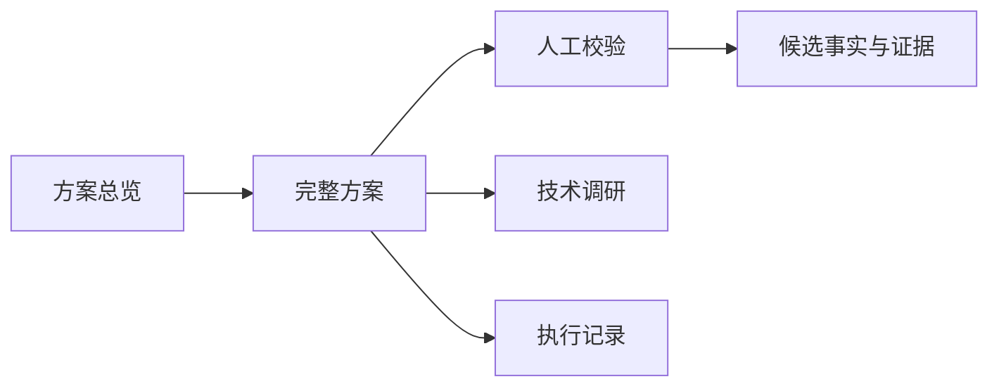

# 文档导航

本目录保存项目的长期设计、验收与人工操作说明；原始 PDF、运行工件、Excel 和缓存均位于 `data/` 或 `runs/`，不进入 `docs/`。

## 从这里开始

1. [方案总览](2026-08-28-abs-data-ai-collection-feasibility-and-production-plan-overview.md)：面向业务与评审的三部分摘要，说明已验证能力、当前边界和生产演进方向。
2. [完整方案](2026-08-28-abs-data-ai-collection-feasibility-and-production-plan-complete.md)：可行性测试、Demo 自评、MVP-v1 和生产化设计的完整依据。
3. [人工校验手册](manual-human-validation.md)：如何在候选 Excel/证据中复核，并写入正式 `ReviewDecision`。

## 参考与工程记录

- [research/](research/)：技术、金融字段、模型与生产架构调研；仅在其结论仍被方案引用时维护。
- [adr/](adr/)：已作出的长期架构决策。
- [evaluations/](evaluations/)：字段切片、回归和验收记录，是工程证据而非对外方案。
- [execution-log.md](execution-log.md)：关键 MVP gate 的简短执行记录。
- [superpowers/](superpowers/)：历史实施计划与规格；不作为当前业务方案入口。

## 文档维护规则

- 新增根目录 Markdown 前，先判断它是否是长期入口、正式决策或可复现验收依据；临时笔记、重复翻译和运行输出不提交。
- 对外结论优先更新“方案总览”和“完整方案”；字段级变更同时更新相应 evaluation 与执行记录。
- 不在文档中保存密钥、原始敏感材料、模型输出全文或可替代 `runs/` 工件的副本。
