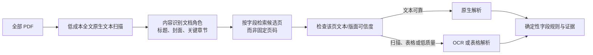
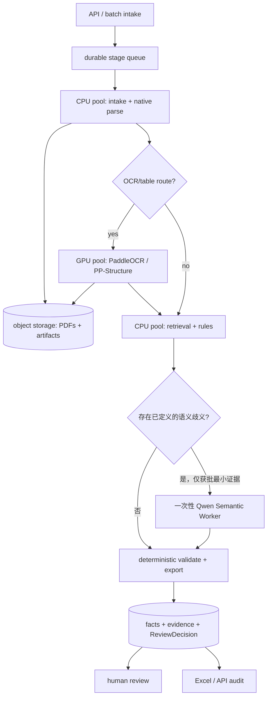

# ABS 数据 AI 采集：可行性测试、Demo 自评与规模化落地方案

日期：2026-08-28
适用范围：不良资产证券化（NPL ABS）PDF 的字段抽取、证据审计与人工确认。
相关业界调研：[生产规模文档抽取架构调研](research/0005-production-scale-document-extraction-architecture.md)。

## 结论摘要

本项目已经证明了一个关键而受限的结论：对一个真实 NPL ABS 产品 bundle，系统能从原始 PDF 出发，产生可回溯到报告、页码、段落或表格单元格的候选事实；12 个 MVP 字段类别均已走通统一命令。它尚未证明 42 字段准确率、跨产品泛化能力、自动确认能力或生产吞吐承诺。

推荐的生产路线不是“把所有 PDF 交给 LLM”，而是保留当前确定性证据链：本地 CPU 原生解析优先，扫描/表格页进入 GPU OCR；只有确有语义歧义时，才由无 Agent loop 的一次性 Qwen Semantic Worker 处理获批的最小证据片段。扩容时先替换调度和存储，不改变 `Evidence`、`ExtractionFact`、`ReviewDecision`、规则版本和字段契约。

## 1. ABS 数据 AI 采集可行性测试思路

### 1.1 要验证的业务假设

| 假设 | 如何证伪/验证 | 通过条件 |
|---|---|---|
| PDF 可以形成可审计字段数据 | 每个非空值反查报告、物理页、原文和 evidence ID | 缺任一证据即不填或进入 fail-closed 状态 |
| 原生 PDF 与扫描件可以共用一个事实契约 | 按页路由原生解析 / OCR，输出统一 block/cell evidence | 解析路径不改变下游字段和证据结构 |
| 金融数值与日期可安全自动化 | 金额、日期、证券代码、公式均用确定性规则验证 | 模型不负责计算、不生成页码/bbox |
| 表格抽取可以复核 | 对真实现金流表保留 row/column/cell 文本和坐标 | 每一行均有单元格证据，合计满足展示精度容差 |
| 人工可以签字而不是重做抽取 | 候选按 field/entity/value/effective_at/evidence 展示 | 复核人可 `accept`、`correct` 或 `reject`，决定不可变 |

### 1.2 测试对象与纵向切片

测试采用一个真实产品 bundle：10 份 PDF、832 页。MVP 不试图一次覆盖全部 42 字段，而选择 12 个代表不同难点的字段类别：证券代码、证券全称、债项评级、初始起算日、到期日、本级发行总额、本级最新余额、初始未偿本息费、首次期间收益支付日、最新报告日期、NPL 受托已回收、现金流归集表。

这 12 类覆盖原生文本、OCR、跨文档关联、动态时点、确定性派生、双机构评级与 one-to-many 表格；不能由此推论未实现字段也已可用。

### 1.3 验收指标与边界

测试以“字段值正确”之外的四项作为同等验收对象：证据精确性、实体/证券档位正确性、动态字段的 `effective_at`、以及不应填写时是否拒绝填写（false fill）。派生事实必须保留输入 fact IDs 和 rule version。人工等待时间不计入机器处理时延。

正式效果评估必须在按产品 bundle 隔离的冻结 gold set 上计算：值完全匹配、证据集完全匹配、状态准确率、false fill、cross-entity leakage 和关键字段失败。当前样例已参与开发，因此不能充当独立验证集。

## 2. Demo 测试采集结果与自我评估

### 2.1 已完成结果

| 项目 | 真实样例结果 | 判断 |
|---|---|---|
| 准入与可追溯性 | 输入文档 SHA-256、解析工件、candidate JSONL、Excel、manifest 均已落盘 | 通过 |
| 解析路径 | 原生文本、OCR 以及 PP-StructureV3 单元格证据已实际运行 | 通过 |
| 12-field vertical slice | 12/12 字段类别在统一 batch 中有候选结果或显式 fail-closed 状态；当前为 0 个抽取 blocker | 通过 |
| Field 39 现金流归集表 | 37 个月度行加 total；p112–113 每个表头/单元格有坐标证据 | 通过 |
| 候选规模 | 71 个 candidate facts，覆盖 22/42 个逻辑字段契约 | 已实现部分，不等于 42 字段完成 |
| 幂等性 | Field 39 候选 JSONL 两次独立运行字节一致 | 通过 |
| 回归验证 | 最近完整离线套件：161 passed、1 skipped | 通过 |
| 人工初审 | 12 类字段的 55 条候选均标为 `accept` | 单 bundle 初审一致性 55/55，不是统计准确率 |

关键产物为 [Field39 候选 Excel](../runs/sample/mvp-v0-field39-candidate.xlsx)、[候选 JSONL](../runs/sample/mvp-v0-field39-candidate.jsonl) 和 [batch manifest](../runs/sample/mvp-v0-field39-candidate.manifest.json)。

### 2.2 能够声明与不能声明的内容

**能够声明**：当前设计已验证“PDF → 证据 → 候选字段 → Excel 审计”的真实闭环；原生解析没有被不必要地重新 OCR；扫描与现金流表能够保留单元格级证据；确定性金额、日期、代码和公式不依赖 LLM。

**不能声明**：

- 不能声明 42 字段准确率、召回率或跨产品泛化，因为没有冻结验证集。
- 不能声明自动确认，业务数据负责人尚未写入正式不可变 `ReviewDecision` 并签字冻结 gold。
- 不能声明并发吞吐或生产 P95；当前是单机串行的真实样例测试，不含队列、GPU 争用、模型调用或供应商网络。
- 不能把“55/55 初审接受”表述为总体准确率。它只说明该产品、该候选集在当前人工初审中没有发现错误。

### 2.3 当前风险与下一步质量门

| 风险/缺口 | 为什么重要 | 最小关闭动作 |
|---|---|---|
| 无冻结 gold set | 无法证明泛化，也不能安全调规则后自证 | 业务负责人签字冻结首批产品级 gold，并另留未参与调优的产品 bundle |
| ReviewDecision 尚未正式追加 | candidate 不等于 confirmed fact | 用现有 review CLI 写入 reviewer、reason code 和不可变决定 |
| 42-field 尚未完成 | 22/42 为当前可抽取覆盖，不应伪装完整 | MVP 验收后逐字段按同一 evidence contract 扩展 |
| 一次性 Semantic Worker 尚未验收 | 仅影响少数语义消歧，不影响本轮确定性抽取 | 获批最小 evidence egress 与 Qwen 配置后，跑一条带审计的单次结构化调用 |
| 性能基线待完成 | 无法进行容量规划 | 本报告附录将写入当前完整 bundle 的 warm-run P50/P95；生产前另做分阶段/并发负载测试 |

### 2.4 MVP-v0 的模板感知路由边界

当前 `extract-folder` 的真实执行路径是**模板感知的定向抽取**，不是可泛化的任意 PDF 理解：它以文件名关键词识别有限文档角色，选择唯一且期次最高的受托报告，再由代码中固定的 `角色 → 页码范围 → parser` 映射解析目标页。真实样例的 10 个文件中，5 个 `processed`、3 个较早受托报告 `superseded`、2 个 `unsupported`；这一结果是当前命令的真实行为，而不是模拟状态。

因此，当前路径适用于文件命名、文档角色、章节位置和模板均已知且稳定的同类 bundle。它不能宣称能在新产品/新机构/页码漂移/命名不规范的材料中自动寻找字段。例如，若现金流表由 p112–113 移到 p130–131，当前实现会 fail closed（无候选或 `no_facts`），不会自动发现新页。这样避免了静默误填，但仍会漏抽。

当前代码虽记录 `native_char_count`、乱码比例、bbox 覆盖率和 `native`/`ocr`/`hybrid` 标签，但该标签在 parser 已被显式选择后才写入工件，尚不是会触发重跑 OCR 的调度决定。也就是说，MVP-v0 已验证“已知模板的安全定向抽取”，尚未验证“未知模板的全文发现、路由和 fallback”。

## 3. 从 Demo 到高并发、低时延的生产方案

### 3.1 MVP-v1：全文发现、parser router 与 fallback

MVP-v1 的目标是让**已有 12-field vertical slice**脱离固定页码，而不是新增字段、引入通用 Agent，或把全文发送给模型。它应在本地先建立每份 PDF 的页面发现索引，再只对字段候选页选择合适的解析器。

**低成本全文原生文本扫描如何做：**对每一页直接读取 PDF 已嵌入的文字对象（与当前 `pypdf` 的 `extract_text()` 相同），不渲染页面、不调用 OCR、不运行表格识别，也不调用 LLM。扫描输出轻量页面索引：页码、文本长度、坏字符比、规范化标题/关键词/表头命中以及少量上下文片段或 hash。随后字段规则以章节锚点和关键词检索少量候选页，例如搜索“现金流归集表”以及“期间/金额/占比”表头，而不是假设它在第 112 页。

这一步对有文字层的长 PDF 通常远低于逐页 OCR 成本，但“低成本”必须以实际 benchmark 验证，不应在没有测量前承诺固定时延。它也不是万能的：纯扫描 PDF 的原生扫描会得到空或极少文本；此时 router 应标记 `scan_required`，使用 OCR 识别封面/目录以确定角色，并对该文档所需候选范围执行 OCR。若扫描材料既无可用目录又需要任意字段的高召回，最终仍可能需要更大范围乃至全文 OCR，不能用原生扫描凭空避免该成本。

MVP-v1 最小工作与验收门：

| 工作 | 最小行为 | 验收 |
|---|---|---|
| 文档角色发现 | 以封面标题、关键章节和允许的文件名作为互相校验的信号 | 角色不唯一即 `ambiguous`，不能因文件名猜测 |
| 候选页检索 | 用字段契约中的章节锚点、关键词和表头在页面索引中返回有限候选页 | 已知目标页在候选集内；无命中不填值 |
| parser router | 原生文字充分时走 native；扫描、关键 token 不完整或复杂表格时走 OCR/hybrid | 每个路由带可复核 reason code |
| bounded fallback | 原生候选抽取失败时，只对同一候选集/经验证的相邻页升级 OCR；不无限扩大扫描范围 | fallback 后仍不唯一则 review/fail closed |
| 冻结评测 | 用未参与调优的新产品/新模板 bundle 比较 page-retrieval recall、字段/证据准确率、false fill 和增量时延 | 未达到门槛不替换 MVP-v0 路径 |

### 3.2 目标架构（MVP-v1 验收后）

生产主路径采用方案 A：**确定性 Python workflow + 按需的一次性 Qwen Semantic Worker + 独立 `ReviewDecision`**。文档数据平面由可独立扩缩的 worker pool 承担，外部队列负责批任务调度；模型不拥有 Agent session，也不自主选择或循环调用工具。业务事实始终保留在 provider-neutral 的证据/事实/复核契约中。

原则如下：

1. 每条 stage 消息带 `document_sha256`、bundle、stage、attempt 和 workflow/parser/OCR/rule/model version；输出工件成功持久化后才确认消息。重复投递命中同一 hash + version 即复用结果。
2. CPU 原生解析、GPU OCR/table、模型调用各自限流，避免长表格或模型供应商配额阻塞普通文本 PDF。
3. 确定性 retriever 在调用前选好 evidence IDs；Semantic Worker 只接收这些 evidence、字段 schema、prompt hash、egress authorization 和 token budget，并在一次结构化 Qwen 请求后结束。它不得自行检索全文、产生页码/bbox 或执行财务计算。
4. 服务端以 Pydantic/JSON Schema 校验返回值，反查 evidence ID 与 exact quote，再写入 proposed candidate；正式业务确认仍由独立、不可变的 `ReviewDecision` 承担。
5. 每次调用记录 provider/model snapshot、request/response hash、evidence IDs、token、延迟和 candidate fact IDs；默认全文不外发，只允许获批文本片段或必要 page crop。
6. 观测按 stage、路由和文档族分别记录服务时间与 queue age 的 P50/P95/P99；人工等待时间单列。

**升级条件：**只有冻结验证集和真实 failure case 证明“一次性调用因证据不足而失败，且模型必须自己多轮调用证据工具才能显著提高字段/证据质量”，才尝试方案 B（最多 2–3 轮、仅允许 `retrieve_evidence`、`validate_facts`、`request_review` 的自建 bounded loop）或 Pi Agent Core。升级必须同时比较准确率、证据完整性、false fill、P95、token 成本和运行故障率；未证明净收益时继续使用方案 A。

业界证据和选型边界见 [调研](research/0005-production-scale-document-extraction-architecture.md)：AWS/Azure/GCP 的异步作业与配额模式可借鉴，但不应替换本地证据 ownership；Docling Serve、Ray、Kafka/Flink 只在对应规模触发时引入。

### 3.3 分档目标与最小实现

当前样例为 83.2 页/文档、扫描页约 3.97%，只用于初始外推；生产节点数必须用真实页数、扫描率、表格率、token 和到达峰值重新测量。

| 档位 | 业务目标 | 由样例推导的最低平均页率 | 需要新增的最小能力 | 明确不做 |
|---|---:|---:|---|---|
| 当前 MVP | 正确性与人工可验收 | 不设 SLA | 本地 artifacts、单机 CLI、人工复核 | 不上队列/数据库/微服务 |
| 1,000 文档 / 4h | 文本 P95 ≤2min；OCR-heavy P95 ≤5min | 5.78 page/s；0.23 OCR page/s | 对象存储、关系库、**一种**持久队列、CPU/GPU 分池和 dead-letter | 不上 Kafka/Flink/Kubernetes，除非企业标准强制 |
| 10,000 文档 / 24h | 与 1k 相同单文档 P95，且在负载下稳定 | 9.63 page/s；0.38 OCR page/s | interactive/batch 优先级隔离、queue-age autoscaling、模型 token/concurrency 限流 | 不重写业务 schema 或把所有字段改 LLM |
| 1,000,000 文档 / 30d | 回填不挤占在线任务 | 32.10 page/s；1.27 OCR page/s | 多可用区存储/数据库、hash 分区、独立 backfill 配额；若需多消费者/replay 再评估 Kafka | 不假设 exactly-once 或预先引入 Flink |

### 3.4 落地实施计划

| 阶段 | 交付 | 进入下一阶段的验收门 |
|---|---|---|
| A：MVP-v0 冻结（现在） | 正式 ReviewDecision、confirmed facts、首个 gold、完整 bundle 延迟基线 | 12 字段业务签字；每个非空值有证据；重跑幂等 |
| B：MVP-v1 泛化路由 | 全文原生索引、候选页检索、parser router/fallback；按需的一次性 Qwen Semantic Worker；不新增字段 | 在未见模板 bundle 上达到候选页召回、证据和 false-fill 门槛；单次语义调用审计可重放 |
| C：1,000 档试运行 | 容器化 CPU/GPU worker、对象存储、关系库、一种 durable queue；按 stage 计时 | 真实代表性负载下达到 P95、证据完整性、false-fill 和恢复重试门槛 |
| D：10,000 档常态化 | 优先级队列、queue-age 扩缩、模型配额/成本治理、daily replay | batch 与交互混跑仍达标，且可定位每个瓶颈资源池 |
| E：百万级回填 | 分区事件/回放、独立回填资源、灾备与合规审计 | 长时间 soak、故障注入和重放保持幂等，不影响线上 SLA |

每一次 parser、OCR、规则或模型变更均必须以固定 gold 回放，比较字段值、证据、false fill、拒绝率、成本和 P95；人工纠正只产生“候选 workflow 变更”，不能自动修改生产规则。

## 4. 需要业务方确认的四项决策

1. CPU/GPU parser 是否必须全程部署在内网；模型能否外发最小 text block、必要 page crop，或必须使用私有模型。
2. 哪些任务属于交互/时效性任务，哪些可作为可抢占的历史回填；队列不能自行猜测业务优先级。
3. 首批 gold 的数据负责人、签字流程、关键字段和允许 false-fill 阈值。
4. 真实生产容量输入：日/峰值到达量、页数分布、扫描页比例、复杂表格率、候选 token 和审核量。没有这些，GPU/节点数只能是估算而非采购依据。

## 附录：当前完整 pipeline latency

测量对象为真实 10-PDF、832 页 product bundle；执行 20 次 warm、串行 `extract-folder`。测量边界为命令接受原始 PDF 到 candidate JSONL、Excel、evidence worksheet 和 manifest 均已写完；不包含人工复核、队列等待、LLM 或并发争用。

| 指标 | 实测值 |
|---|---:|
| 成功率 | 20 / 20 |
| P50 | 127.062 s（2 分 07 秒） |
| P95（nearest-rank） | 138.767 s（2 分 19 秒） |
| 最小 / 最大 | 111.992 s / 147.831 s |
| 最终候选事实 | 71；每个非空值均有 evidence |

原始逐轮记录、模式和分位数计算见 [warm latency JSON](../runs/latency/mvp-v0-field39-warm-latency.json)。该值是单机 MVP 服务时间基线，不是生产 P95 承诺；下一阶段需要在目标硬件上按 CPU/GPU/模型池分阶段打点，并在受控并发与真实到达率下重新压测。
