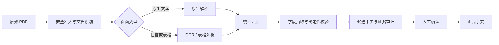
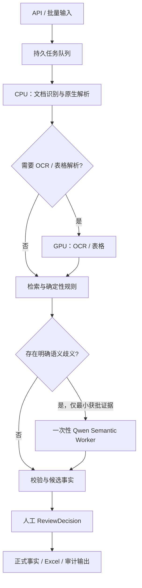

# ABS 数据 AI 采集方案 Overview

日期：2026-08-28
适用范围：不良资产证券化（NPL ABS）PDF 的字段抽取、证据审计、人工确认与生产化演进。
详细方案见：[ABS 数据 AI 采集：可行性测试、Demo 自评与规模化落地方案](2026-08-28-abs-data-ai-collection-feasibility-and-production-plan-complete.md)。

## 核心结论

- 当前 Demo 已在一个真实 NPL ABS 产品 bundle 上跑通从原始 PDF 到带证据候选事实、Excel 审计和人工复核的端到端流程。
- 12 个 MVP 字段类别均已进入统一抽取批次；当前结果证明了技术可行性，但不等同于 42 字段完成、跨产品泛化或生产容量达标。
- 推荐生产主路径为**确定性文档工作流**：原生文本优先，扫描件和表格按需 OCR，少量语义歧义才调用一次性 Qwen Semantic Worker。
- 字段值与证据契约保持模型供应商无关；任何正式事实仍需经过确定性校验和人工 `ReviewDecision`。
- 扩容应优先拆分 CPU、GPU 与模型资源池并替换调度和存储，不重写已经验证的字段、证据和复核逻辑。

## 1. ABS 数据 AI 采集可行性测试思路

测试目标不是只判断“能否从 PDF 找到一个值”，而是验证能否形成一条可审计、可复核、可拒绝错误填充的事实链：

MVP 选择了 12 个纵向切片字段，覆盖证券标识、评级、日期、金额、动态余额、跨文档关联、确定性派生和一对多现金流表等主要难点。

可行性的核心验收标准是：

- 每个非空值都能回到来源文档、页码、原文段落或表格单元格。
- 原生解析、OCR 和表格解析输出统一的证据结构。
- 金额、日期、代码与派生计算由确定性规则验证，模型不负责计算或生成证据坐标。
- 证据不足、实体关联不唯一或业务口径未冻结时，系统应明确拒绝填充。
- 人工复核可以直接接受、修正或拒绝候选，而不必重新阅读整份 PDF。

## 2. Demo 测试采集结果与自我评估

| 项目 | 当前结果 |
|---|---|
| 测试对象 | 1 个真实产品 bundle，10 份 PDF、832 页 |
| MVP 字段 | 12/12 字段类别已进入统一批次，无当前抽取 blocker |
| 候选结果 | 71 个 candidate facts，覆盖当前 22/42 个逻辑字段契约 |
| 表格能力 | 真实现金流表已形成 37 个月度行及 total，并保留单元格证据 |
| 人工初审 | 12 类字段共 55 条候选均被初审标记为接受 |
| 离线回归 | 161 passed、1 skipped |
| 单机延迟 | 真实 bundle warm run：P50 127.062 秒，P95 138.767 秒 |

当前可以确认：

> “PDF → 解析/OCR → 证据 → 候选字段 → Excel 审计”已经在真实样例上闭环，且确定性字段不依赖 LLM。

当前仍不能确认：

- 42 个字段已经全部完成或达到统计意义上的准确率、召回率。
- 当前规则已经适配不同机构、不同模板和页码变化。
- 55/55 的单 bundle 人工初审结果可以代表总体准确率。
- 当前单机串行延迟可以代表高并发生产 P95。
- candidate facts 可以绕过业务数据负责人签字直接成为 confirmed facts。

因此，下一质量门是冻结首批业务 gold set、写入正式 `ReviewDecision`，并使用未参与开发的新产品 bundle 验证泛化能力。

## 3. Demo 至生产环境的设计框架与落地路径

生产架构采用方案 A：**确定性 Python workflow + 按需的一次性 Qwen Semantic Worker + 独立人工复核**。

设计原则：

- PDF、全文解析与 OCR 默认在受控环境处理；模型只接收获批的必要证据片段。
- 原生文本、OCR、表格和模型任务分别调度与扩缩，避免重任务阻塞普通文档。
- 每个阶段以输入哈希和版本保证幂等、可重跑和可审计。
- 模型只做语义选择，不计算金融值、不创建页码或坐标，也不替代人工签字。
- 默认不运行 Agent loop。只有真实验证证明模型必须自主多轮调用证据工具才能显著提升质量，才评估受限方案 B 或 Pi Agent Core。

落地分为三个层次：

| 阶段 | 核心目标 |
|---|---|
| MVP 冻结 | 完成正式人工确认、首个 gold set、幂等复跑和延迟基线 |
| MVP-v1 泛化 | 用全文轻量索引、候选页检索和 parser fallback 取代固定页码；继续验证现有 12 字段 |
| 生产扩容 | 根据 1,000、10,000 和百万级任务的真实负载，逐步增加持久存储、任务队列、CPU/GPU 资源隔离、优先级与回放能力 |

最终目标不是建立一个自主阅读全部 PDF 的通用 Agent，而是形成一个可扩缩的、证据优先的文档数据流水线：确定性路径负责绝大部分工作，模型处理少量经过控制的语义歧义，人工对最终业务事实负责。
