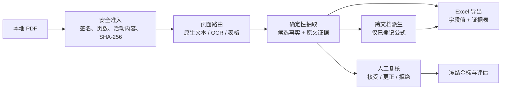

# 人工校验手册：不良资产证券 PDF 抽取工作流与样例结果

更新日期：2026-08-22  
适用样例：`臻粹2026年第二期不良资产证券_测试样例2`  
用途：业务数据负责人或复核人员对候选事实进行逐项确认；这不是业务签字记录。

## 1. 先看全流程

原则：每个候选值必须能回到**报告名、页码、表/段落、原文和证据 ID**。无法唯一确定时，系统应留空或输出相应状态，不能猜测。

## 2. 人工复核时看什么

对每一条候选事实，按以下顺序核验：

1. **对象是否正确**：`product:` 是产品级、`security:` 是分档证券级、`report:` 是受托报告级；不能把产品值写到某一证券行。
2. **来源是否正确**：发行结果用于最终发行额；发行说明书用于合同结构；受托报告用于当期余额和回收；评级报告用于评级。
3. **证据是否可定位**：报告名、页码、段落/表名、原文和 evidence ID 必须一致；不要只根据相邻文字判断。
4. **时间是否正确**：余额、回收等动态事实必须检查 `effective_at`，不要用报告出具日替代支付后生效日。
5. **状态是否正确**：
   - `disclosed`：原文直接披露；
   - `derived`：登记公式、输入事实和版本齐全；
   - `not_applicable` / `not_disclosed`：不得填数值；
   - `ambiguous` / `pending_definition`：不得作为已确认业务值导出。
6. **是否存在不应填充**：NPL 静态池的正常贷款池指标（如累计违约率、早偿率）不能因“看起来完整”而填 0 或 100%。

## 3. 当前样例：可人工抽查的结果

下表是已实现字段中的优先抽查项。状态“CLI 已验证”表示真实样例已走过准入、解析、事实持久化和证据生成；“函数级已验证”表示公式及真实输入已经验证，但尚未纳入一个跨文档候选汇总命令。

| 字段 | 当前样例值 | 状态 | 建议核对位置 |
|---|---|---|---|
| 证券代码 | 优先 `2689075`；次级 `2689076` | CLI 已验证 | 《簿记建档发行结果公告》OCR 证券信息表 |
| 证券全称 | 分档证券全称 | CLI 已验证 | 《发行公告》p1 标题 |
| 债项评级 | 优先档：中债资信/中诚信国际均 `AAAsf`；次级无评级 | CLI 已验证 | 《发行说明书》p2 评级表；每档关联发行结果的证券代码 |
| 初始起算日 | `2026-01-26` | CLI 已验证 | 《发行公告》p2 |
| 到期日 | 优先 `2028-02-23`；次级 `2029-04-23` | CLI 已验证 | 《簿记建档发行结果公告》证券信息表 |
| 本级发行总额 | 优先 `1.32`；次级 `0.50`（亿元） | CLI 已验证 | 《簿记建档发行结果公告》“实际发行总额” |
| 本级最新余额 | 优先 `0.839784`；次级 `0.50`（亿元） | CLI 已验证 | 《第4期受托机构报告》p5 支付日、p6 支付后剩余本金 |
| 是否含循环购买 | `false` | CLI 已验证 | 《发行说明书》p90 静态池、不购买/替换资产相邻原文 |
| 预计首个收益支付日 | 两档均 `2026-05-23` | CLI 已验证 | 《发行说明书》p2；须有证券档位关联证据 |
| 市场 / 发行方式 | 银行间债券市场 / 簿记建档 | CLI 已验证 | 《发行说明书》p3 唯一陈述 |
| 最新报告日期 | `2026-08-17` | CLI 已验证 | 《第4期受托机构报告》p1 |
| NPL-受托已回收 | `0.6040795674`（亿元） | CLI 已验证 | 《第4期受托机构报告》p7：处置中累计回收 + 处置完毕累计回收；排除其他收入 |
| 单张剩余面额 | 优先 `63.62`；次级 `100.00`（元） | 函数级已验证 | 发行结果的发行额 + 发行说明书 p120/p121 初始面值 + 第4期受托报告支付后余额 |
| 实际融资主体 | 广发银行股份有限公司 | CLI 已验证 | 《发行说明书》p16 参与机构名单的“发起机构/贷款服务机构” |

完整覆盖状态见 [vertical-slice-progress](evaluations/2026-08-22-vertical-slice-progress.md)，各字段的详细证据和拒绝边界见 `docs/evaluations/` 下对应切片文档。

## 4. 两个重点公式的人工校验

### 4.1 NPL-受托已回收（字段 35）

公式：`处置中累计回收 + 处置完毕累计回收`，不扣处置费用，排除其他收入和合格投资。

样例：`(30,466,642.99 + 29,941,313.75) / 100,000,000 = 0.6040795674` 亿元。

人工要确认 p7 的两个“累计回收”行属于资产处置；不要把包含“其他现金流流入”的总额直接用于公式。

### 4.2 单张剩余面额（字段 40）

公式：`支付后剩余本金 / 实际发行额 × 已披露初始面值`，结果单位为元，按 `ROUND_HALF_UP` 保留两位小数。

| 证券 | 核验计算 | 结果 | 生效日 |
|---|---|---:|---|
| `2689075` | `0.839784 / 1.32 × 100` | `63.62` | `2026-08-24` |
| `2689076` | `0.50 / 0.50 × 100` | `100.00` | `2026-08-24` |

必须同时看到三个输入的证据。缺一个、证券代码不一致、余额生效日不一致、余额大于发行额或值重复时，应拒绝候选而不是手工补数。详见 [unit-remaining-face-value-slice](evaluations/2026-08-22-unit-remaining-face-value-slice.md)。

## 5. 在 Excel 中怎么验

导出的工作簿按实体拆分工作表，并包含“证据”工作表。人工校验建议：

1. 先在对应 `security_<code>`、`product_*` 或 `report_*` 工作表核对主值。
2. 再在“证据”表按“实体 + 字段”筛选，逐条回看报告名、页码、表/段落和原文。
3. 对派生值，核对证据表中是否包含所有输入事实，及 `effective_at` 是否与业务时点一致。
4. 若同一实体同一字段有多个候选，主值不应被静默覆盖；应进入人工裁决。

Excel 导出只写入 `disclosed` 或 `derived` 的非空、无歧义值；其他状态仍保留证据审计信息，但不应成为主单元格值。详见 [excel-export-slice](evaluations/2026-08-22-excel-export-slice.md)。

## 6. 如何作出人工决定

人工决定是追加的不可变事件，而不是修改原始候选：

| 决定 | 何时使用 | 结果 |
|---|---|---|
| `accept` | 值、证据、粒度和时点均正确 | 生成新的 `confirmed:` 事实 |
| `correct` | 候选不正确，但复核人能给出合规的替代事实 | 保留候选，并写入新的已确认更正事实 |
| `reject` | 证据不足、来源冲突、时点不符或不适用 | 保留拒绝理由，不生成确认值 |

复核人应填写可追溯的 reviewer ID 和原因码。对于派生事实，只有所有输入已确认后，派生结果才可被确认。详见 [review-decision-slice](evaluations/2026-08-22-review-decision-slice.md)。

## 7. 结果验收与当前未完成项

验收不是只看“值对不对”。冻结金标应逐字段记录：值、状态、实体、有效日期和完整 evidence-ID 集。评估器输出五项：总事实数、值完全匹配数、证据集完全匹配数、误填数和关键字段失败数。详见 [gold-evaluation-contract](evaluations/2026-08-22-gold-evaluation-contract.md)。

当前需要业务侧确认或补齐的事项：

- 由业务数据负责人签字冻结首个真实金标集；在此之前，不能声称模型准确率或自动确认质量。
- 字段 4/5 的分类码表，以及字段 42“大额非分散”的阈值和布尔规则。
- 字段 39 现金流归集表仍需在原生 x86 环境完成 PP-Structure 的表格/单元格坐标预检。
- 期间收益率在本地材料没有唯一的实际 `2.00%` 原文，且现有契约尚未表达 `rate_type`；当前保持不填，避免猜测。

## 8. 人工签字前的最小清单

- [ ] 每个确认值均有报告名、页码、表/段落、原文、evidence ID。
- [ ] 每个动态值均已核对有效日期而非仅报告日期。
- [ ] 每个派生值均有公式、规则版本和全部输入事实。
- [ ] `not_applicable`、`not_disclosed`、`ambiguous`、`pending_definition` 没有被当作数值导出。
- [ ] 候选、人工决定和确认事实可分别追溯，未覆盖原始候选。
- [ ] 金标由业务数据负责人签字，并与开发/验证/留出产品隔离。
