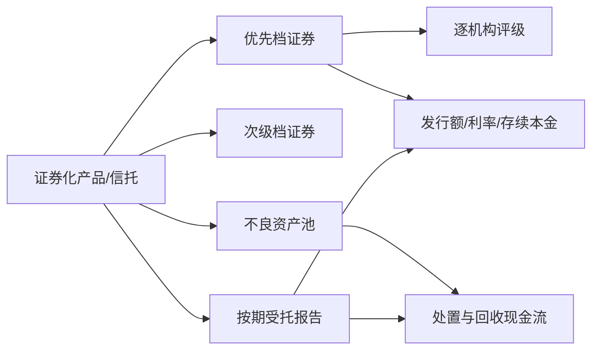
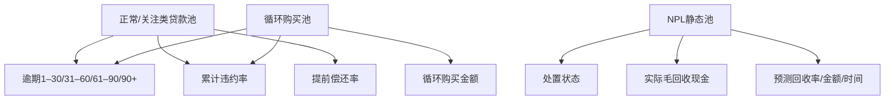

# 不良资产证券 42 字段：金融定义、样例决策与依据

调研日期：2026-08-21  
适用样例：`臻粹2026年第二期不良资产证券_测试样例2`  
状态：字段 Q43–Q47 已由需求方接受；字段4/5与42仍等待业务数据负责人提供正式码表/阈值；不是法律意见

## 结论摘要

原 Excel 的 42 项不是同一粒度、同一时间或同一产品模板下的 42 个标量。它至少混合了产品、分层证券、报告快照、评级、现金流明细和资产池表现六类对象：

因此推荐保留原 42 列作为 Excel 导出视图，但内部必须使用规范化事实模型。最关键的业务决策是：

1. 字段 2 定义为“证券全称”，另存产品全称；产品下每一档证券各有一行。
2. 字段 3 是逐评级机构数组，不生成“综合评级”。
3. 字段 7 拆为预期到期日和法定到期日；原 Excel 只导出预期到期日。
4. 字段 13/14 的“最新余额”必须绑定余额类型和生效日，不能绑定报告出具日。
5. 字段 23、27–34 大多属于正常类贷款池或循环池指标；当前 NPL 静态池应标 `not_applicable`，不能填 0、100% 或以回收率替代。
6. 字段 35 定义为基础资产毛回收现金，排除其他收入和合格投资；样例为 **0.6040795674 亿元**。
7. 字段 39 是子表，不是单个单元格；字段 40 是按档派生值。
8. 字段 41 的融资主体是发起机构广发银行；华润信托是发行人/受托机构，角色不能合并。
9. 字段 42“是否大额非分散”没有统一监管定义；1%只是特定披露豁免阈值，不能直接拿来做分类。样例先存集中度事实，导出状态为 `pending_definition`。

## 一手资料及适用层级

本报告按以下顺序使用资料：

1. 人民银行、金融监管总局的规章和官方解释；
2. 交易商协会现行信贷资产证券化披露指引及表格体系；
3. 中国货币网的正式发行、上市和存续期披露；
4. 本地样例发行说明书、评级报告和受托报告。

交易商协会 2022 年发布的是“修订公开征求意见稿”，不能当作已经生效的最终规则；本报告以 2016 年现行 NPL 指引为主要口径。[现行 NPL 指引公告](https://www.nafmii.org.cn/zlgl/zlgz/cpcxl_1058/201604/t20160419_198923.html)、[2022 年征求意见通知](https://www.nafmii.org.cn/ggtz/tz/202212/t20221230_311758.html)

## 42 字段决策矩阵

状态约定：

- `disclosed`：文档直接披露；
- `derived`：依据已登记公式/日历派生；
- `not_applicable`：该产品结构不适用；
- `not_disclosed`：适用但材料未披露；
- `pending_definition`：公司字段尚无经确认的业务码表或阈值；
- `ambiguous`：来源冲突或原文不足以唯一确定。

### A. 证券身份、分类、日期与发行条款（1–22）

| # | 原字段 | 推荐定义与粒度 | 臻粹样例决策 | 主要依据与精确证据位置 |
|---:|---|---|---|---|
| 1 | 证券代码 | 每一分层证券的登记交易代码 | 两行：优先档 `2689075`；次级档 `2689076`；`disclosed` | 中国货币网《债券上市流通公告(26臻粹2优先)》“证券名称/证券代码”表；优先档代码可在线复核。[上市公告](https://www.chinamoney.com.cn/chinese/ltss1/20260427/3325058.html) |
| 2 | 资产全称 | **改定义为证券全称**；另设产品全称 | 优先档、次级档分别保存正式名称；`disclosed` | 同一上市公告“证券名称”行；监管要求各档分别列本金、评级、利率、期限，证明产品与证券不是同一对象。[信贷资产证券化试点监督管理办法](https://www.moj.gov.cn/pub/sfbgw/flfggz/flfggzbmgz/200606/t20060606_144068.html) |
| 3 | 债项评级 | `{机构, 原始等级, 归一等级, 日期, 初始/跟踪}` 数组，证券级 | 优先档中诚信国际与中债资信均为 `AAAsf`；次级档未评级；`disclosed` | 两份本地《信用评级报告及跟踪评级安排》评级结论段；上市公告“债项/主体评级一/二、信用评级机构一/二”表。保留评级报告原文 `sf` 后缀，不生成综合评级。[评级管理规定](https://www.pbc.gov.cn/tiaofasi/144941/144957/3930712/2019112916560360082.pdf) |
| 4 | 债券类型-一级 | 公司/供应商分类码表，不应从监管术语猜测 | `pending_definition`；保留文档原始产品类型“NPL ABS” | 央行统计分类只能证明广义金融工具类别，不能证明当前 Excel 的“一级/三级”码表。[金融工具统计分类标准](https://wuhan.pbc.gov.cn/eportal/fileDir/image_public/UserFiles/diaochatongjisi/upload/File/%E9%87%91%E8%9E%8D%E5%B7%A5%E5%85%B7%E7%BB%9F%E8%AE%A1%E5%88%86%E7%B1%BB%E5%8F%8A%E7%BC%96%E7%A0%81%E6%A0%87%E5%87%86%EF%BC%88%E8%AF%95%E8%A1%8C%EF%BC%89.pdf) |
| 5 | 债券类型-三级 | 依赖一级/二级及码表版本的叶子分类 | `pending_definition`；不能因文件名自动创造枚举 | 同字段 4；需业务负责人提供目标数据库现有码表及版本。 |
| 6 | 初始起算日 | 资产池静态信息和预测现金流采用的基准日，产品级 | `2026-01-26`；`disclosed` | 本地《发行说明书》PDF p90“合格标准/初始起算日”及资产池统计章节。 |
| 7 | 到期日期 | 拆为证券级 `expected_maturity_date + scenario` 与产品级 `legal_final_maturity_date` | 优先档预期 `2028-02-23`；次级档预期 `2029-04-23`；法定到期 `2032-04-23`；`disclosed` | 本地《发行说明书》发行要素/交易结构段；上市公告“兑付日”为优先档 `2028-02-23`。预期日是预测，法定日是最终法律期限，不能覆盖。[官方发行说明书实例](https://www.chinamoney.com.cn/dqs/cm-s-notice-query/fileDownLoad.do?contentId=2959856&mode=open&priority=0) |
| 8 | 发行总额-优先级 | 优先档最终实际发行本金，亿元 | `1.32`；`disclosed` | 本地《簿记建档发行结果公告》“簿记建档发行结果”表；上市公告“发行总额（亿元）”行亦为 1.32。[上市公告](https://www.chinamoney.com.cn/chinese/ltss1/20260427/3325058.html) |
| 9 | 发行总额-次优级 | 次优档最终实际发行本金；仅存在该档时适用 | 本产品无次优档：`not_applicable`，不是 0 | 本地《发行说明书》发行要素表只列优先档与次级档。 |
| 10 | 发行总额-次级 | 次级档最终实际发行本金，亿元 | `0.50`；`disclosed` | 本地《簿记建档发行结果公告》“簿记建档发行结果”表。 |
| 11 | 发行总额-各级发行总额 | 产品下全部档位最终发行本金之和 | `1.82`；可直接披露并用 `1.32+0.50` 勾稽 | 本地《簿记建档发行结果公告》发行结果表；应同时保存披露总计和重算总计。 |
| 12 | 发行总额-本级发行总额 | 当前证券行对应档位的最终发行本金 | 优先行 `1.32`，次级行 `0.50`；`disclosed` | 同字段 8、10；必须由 `security_code + tranche` 决定“本级”。 |
| 13 | 最新余额-各级最新余额 | 各档证券余额数组；每项带余额类型、报告期末、报告日和生效日 | 第4期报告披露支付后余额：优先 `0.839784` 亿元、次级 `0.50` 亿元，生效日 `2026-08-24` | 本地《受托机构报告2026年度第4期总第4期》PDF p5，证券本息兑付表“本息兑付后剩余本金”；报告日 p1 为 `2026-08-17`、报告期末 p2 为 `2026-07-31`，三者不能混用。现行 NPL 指引 S-0/S-2 也分别要求这些日期和余额。[NPL 指引 PDF](https://www.nafmii.org.cn/ggtz/gg/201604/P020220117434511429404.pdf) |
| 14 | 最新余额-本级最新余额 | 当前证券行对应的支付后剩余本金 | 优先行 `0.839784`，次级行 `0.50`；与字段13同一证据和生效日 | 同字段 13。查询“截至某日实际余额”时，只能选择 `effective_date <= query_date` 的事实。 |
| 15 | 底层资产未偿本息费初始余额（元） | 初始起算日入池贷款未偿本金、利息及费用之和，产品级 | `3,142,587,244.45` 元；`disclosed` | 本地《发行说明书》PDF p104“评级机构现金流估计金额及特征”及资产池总体信息表；注意不是证券发行额。 |
| 16 | 层级 | 证券受偿顺序的原始档位与标准枚举 | 优先档 / 次级档；`disclosed` | 《发行说明书》发行要素和现金流支付顺序；央行解释说明优先档先受偿、次级档先吸收损失。[央行官方问答](https://www.pbc.gov.cn/english/130721/2025080815063458932/index.html) |
| 17 | 是否含循环购买 | 是否用资产现金流再次购买新的同类合格资产 | `false`；`disclosed` | 本地《发行说明书》PDF p90 明确“静态池，信托财产交付日后不会购买其他资产或替换已有资产（例外赎回除外）”。循环购买的正式定义可参见交易商协会规则第25条。[规则 PDF](https://www.nafmii.org.cn/ggtz/gg/202303/P020230316624621277408.pdf) |
| 18 | 付息频率 | 每一有息档证券按合同支付收益的频率 | 优先档“每月”；次级档若无固定票息则不强填同值 | 上市公告“付息频率：每月”；《发行说明书》支付日定义。[上市公告](https://www.chinamoney.com.cn/chinese/ltss1/20260427/3325058.html) |
| 19 | 预计首个期间收益支付日 | 拆为约定日、营业日调整后日期、实际日期、计息终止日 | 约定 `2026-05-23`，调整/实际 `2026-05-25`；分别保存；`disclosed + derived` | 本地《发行说明书》支付日定义与首个支付日；首期《受托机构报告》证券本息兑付表验证实际日期。支付日顺延不必然改变计息终止日。[官方说明书实例](https://www.chinamoney.com.cn/dqs/cm-s-notice-query/fileDownLoad.do?contentId=2959856&mode=open&priority=0) |
| 20 | 期间收益率 | 必须带 `rate_type`；优先档通常是票面利率，次级档可能是或有/封顶期间收益率 | 优先档 `coupon_rate=2.00%`；次级档不强填；`disclosed/not_disclosed` | 上市公告“票面利率 2.0000%”；《发行说明书》发行要素及收益支付条款。不要把所有档位的“期间收益率”理解成同一种利率。 |
| 21 | 市场 | 证券登记交易市场 | 银行间债券市场；`disclosed` | 上市公告正文及“流通范围”行。[上市公告](https://www.chinamoney.com.cn/chinese/ltss1/20260427/3325058.html) |
| 22 | 发行方式 | 实际采用的定价/配售方式 | 簿记建档；`disclosed` | 本地《簿记建档发行结果公告》标题及发行结果表；簿记建档是询价、申购、定价和配售机制。[簿记建档规范指引](https://www.nafmii.org.cn/ggtz/gg/201309/t20130902_198022.html) |

### B. 报告时点、资产池表现与回收（23–37）

金融监管总局《商业银行金融资产风险分类办法》第六条规定，正常、关注、次级、可疑、损失五类中，后三类合称不良资产。也就是说，NPL 池在入池前已经进入不良状态，不能把“全部已是不良”错误翻译成“存续期累计违约率 100%”。[风险分类办法](https://www.nfra.gov.cn/cn/view/pages/rulesDetail.html?docId=1095372)

| # | 原字段 | 推荐定义与粒度 | 臻粹样例决策 | 主要依据与精确证据位置 |
|---:|---|---|---|---|
| 23 | 累计违约率口径 | 对正常池需保存违约事件定义、分子、分母、观察窗口和交易文件原文 | 当前 NPL 静态池 `not_applicable`；不能填 100% | 四期受托报告均无累计违约率；《发行说明书》p90/p104–105 表明入池资产已为次级/可疑/损失类不良债权。NPL 现行指引要求的是处置和回收，不是正常池迁徙指标。[NPL 指引](https://www.nafmii.org.cn/zlgl/zlgz/cpcxl_1058/201604/P020220120403785249612.pdf) |
| 24 | 报告更新频率 | 监管触发是“每个支付日前”，产品可再归一为月/季 | `trigger=per_payment_date`；样例支付周期为月度，归一 `monthly`；`derived` | 《发行说明书》p180 计算日为月末，p181 支付日和受托机构报告日定义，p154 每个报告日披露；四期报告日期和收款期佐证月频。现行 NPL 指引第23条规定兑付日前披露。 |
| 25 | 最新报告日期 | 最新有效受托报告的实际出具日期 | `2026-08-17`；`disclosed` | 《受托机构报告2026年度第4期总第4期》PDF p1“报告日期”；报告覆盖期间见 p2。 |
| 26 | 下一报告日期 | 按下一支付日、合同提前工作日数和正式营业日日历计算的计划日期 | `2026-09-16`，仅作为 `derived/scheduled`；若导出只接受披露事实则留空 | 《发行说明书》p181：支付日为计算日下月23日，受托报告日为支付日前第5个工作日。保存规则证据、日历版本和计算时间；未来公告可变更结果。 |
| 27 | 累计逾期90+贷款金额 | 必须明确是期末快照还是历史上曾达到阈值；正常池常按报告期末桶披露 | 当前 NPL 池 `not_applicable` | 样例只有《发行说明书》p107 初始逾期月份粗桶，无法精确切 90 天，且不是存续期累计指标。正常消费类指引才要求 1–30/31–60/61–90/90+ 桶。[消费贷款指引](https://www.nafmii.org.cn/ggtz/gg/201902/P020220117435006188541.pdf) |
| 28 | 逾期90+贷款占比 | 与字段27同口径，必须声明分母 | `not_applicable`；不得把初始“>3个月”粗桶 96.68% 当正式 90+ | 同字段27；边界无法判断恰好三个月，分母与观察时点也不同。 |
| 29 | 累计逾期30+贷款金额 | 与字段27同理；“累计”与“期末快照”不得混用 | `not_applicable` | 初始 `(0,3]月` 桶不能拆出 30 天，四期受托报告未披露。 |
| 30 | 逾期30+贷款占比 | 与字段29同口径并绑定分母 | `not_applicable` | 同字段29。 |
| 31 | 累计违约率（受托报告披露） | 正常池受托报告按交易定义披露的期末累计违约率 | 当前 NPL 池 `not_applicable`；不要填 0 | 四期本地受托报告全文均无该字段；NPL 指引存续期表格未要求该指标。 |
| 32 | 早偿率 | 正常履约贷款在计划前偿还的速率，需保存 CPR/APR 等类型、公式与年化方式 | 当前 NPL 池 `not_applicable`；不要填 0 | 样例和现行 NPL 指引使用“处置回收”，不是“提前偿还”；四期报告均未披露早偿。 |
| 33 | 循环购买资产总额 | 仅在持续/循环购买结构中统计购买新资产的金额 | 真值层 `applicability=false, value=null`；如旧系统强制数值，可另派生导出 0 | 《发行说明书》p90 明确静态池且不再购买；0 和“不适用”必须区分。 |
| 34 | 静态池口径违约率 | 正常贷款历史静态池的违约表现；与 NPL 静态样本池回收率不同 | 当前样例 `not_applicable`；不能把 7.90% 填入 | 《发行说明书》p98 定义“静态样本池各期条件回收率”，p99–100用于回收预测，不是违约率。 |
| 35 | NPL-受托已回收（亿） | **基础资产毛回收现金**：处置中 + 处置完毕；不扣处置费用，排除其他收入/合格投资 | `(30,466,642.99 + 29,941,313.75) / 1e8 = 0.6040795674` 亿元；两个组成值为 `disclosed`，字段结果为规则计算的 `derived` | 《第4期总第4期受托报告》PDF p7，“四、资产池表现情况（三）资金池现金流流入”及处置状态回收行。该页现金流入总计 60,413,137.71 元含其他收入 5,180.97 元，不能直接当回收额。现行 NPL 指引 S-3-2/附件6把回收与其他收入、合格投资分列。[NPL 指引 PDF](https://www.nafmii.org.cn/zlgl/zlgz/cpcxl_1058/201604/P020220120403785249612.pdf) |
| 36 | 中债预测回收率 | 中债资信在发行时对资产池预计总回收额/入池未偿本息费余额的预测率 | `7.90%`；发行快照 `disclosed`，不被后续受托报告覆盖 | 《发行说明书》p104“评级机构现金流估计金额及特征”，脚注给出公式；p112再次披露。 |
| 37 | 中债预测回收金额（亿） | 与字段36同一预测版本的预计总回收额 | `24,827.66万元 = 2.482766亿元`；`disclosed` | 《发行说明书》p104/p112；p102–103说明两机构独立估值并采用中债结果披露。 |

### C. 预测、现金流、单位面额、机构角色与集中度（38–42）

| # | 原字段 | 推荐定义与粒度 | 臻粹样例决策 | 主要依据与精确证据位置 |
|---:|---|---|---|---|
| 38 | 发行时预测现金流机构 | 对资产池预计回收金额/时间出具预测或评级现金流分析的机构数组，并标记最终采用版本 | 中债资信、中诚信国际均做独立预测；发行说明书采用中债披露值；`disclosed` | 《发行说明书》p102“两家评级机构独立估值”、p103“采用中债结果”、p104预测表；交易商协会规则把现金流预测机构列为独立中介机构，不能与发行人混同。[规则第7条](https://www.nafmii.org.cn/ggtz/gg/202303/P020230316624621277408.pdf) |
| 39 | 现金流归集表 | 子表：每行包含期间、金额、占比、累计值、单位、预测机构、情景和证据 | 提取《发行说明书》37个月预测现金流行；保留披露总计与重算总计 | 《发行说明书》现金流预测表；逐行金额合计 24,827.67 万元而披露总计 24,827.66 万元、占比逐行合计 99.99% 而总计 100.00%，属于显示精度可解释差异。容差按 `行数 × 0.5 × 10^-小数位` 计算，不能硬编码 0.01。 |
| 40 | 单张剩余面额 | 每 100 元初始面值对应的当前剩余本金，证券级派生值 | 第4期支付后：优先 `83,978,400 / 132,000,000 × 100 = 63.62元`；次级 `50,000,000 / 50,000,000 × 100 = 100.00元`；`derived`，生效 `2026-08-24` | 初始面值 100 元见上市公告“面值”；分档发行额见发行结果；支付后余额见第4期受托报告 p5。必须记录公式和输入证据。[上市公告](https://www.chinamoney.com.cn/chinese/ltss1/20260427/3325058.html) |
| 41 | 实际融资主体 | 通过向 SPV/受托机构转移基础资产而获得资金的发起机构；与证券发行人分开 | 融资主体/发起机构：广发银行股份有限公司；发行人/受托机构：华润深国投信托有限公司；`disclosed` | 上市公告“发起人/发行人”两行；央行官方解释明确发起机构信托基础资产、受托机构发行证券。[央行问答](https://www.pbc.gov.cn/english/130721/2025080815063458932/index.html) |
| 42 | 是否大额非分散 | 业务自定义分类，必须有版本化的集中度指标、阈值和布尔公式 | 输出 `pending_definition`；另存样例事实：131,125户、最大单户未偿本息费约324.47万元，占总额约0.10325%；叙述证据支持“高度分散”，但暂不生成正式布尔值 | 《发行说明书》资产池总体信息/借款人集中度段。现行 NPL 指引 F-7-1 脚注只规定“单一借款人最高未偿本息余额占比小于1%可免披露”，这是披露阈值，不是“大额非分散”统一分类线。[NPL 指引 PDF](https://www.nafmii.org.cn/ggtz/gg/201604/P020220117434511429404.pdf) |

## 为什么 NPL 字段不能照普通贷款 ABS 硬套

这不是“样例恰好没找到值”，而是三套不同指标族。现行 NPL 指引的存续期表格围绕资产处置、实际回收和未来回收预测；正常类消费、住房和汽车贷款披露模板才包含逾期迁徙、累计违约和提前偿还。跨模板硬填会制造看似完整、实则错误的数据。

## 来源选择不是“最新文档覆盖一切”

人民银行《资产支持证券信息披露规则》把发行前、发行结果和存续期披露分成不同阶段：发行说明书负责交易结构，发行结果公告负责实际发行结果，受托报告负责当期资产池和兑付情况。[信息披露规则](https://dcj.mofcom.gov.cn/article/bh/200508/20050800227714.shtml)

| 事实类型 | 首选来源 | 决策理由 |
|---|---|---|
| 证券全称、简称、代码、上市日 | 登记/上市流通公告 | 正式登记交易身份 |
| 实际发行额、最终票息、发行价格 | 簿记建档发行结果公告 | 发行后的实现值替代发行前计划值 |
| 产品结构、法律期限、预期到期假设、支付规则、现金流顺序 | 最终发行说明书/信托合同 | 合同与交易结构定义 |
| 当期兑付、支付后余额、资产池表现 | 对应期次受托机构报告 | 反映特定报告期和支付期的事实 |
| 初始/跟踪评级 | 每家评级机构正式报告 | 评级按机构独立演进 |
| 更正或变更 | 最新有效更正/变更文件 | 仅覆盖其明确更正的事实 |

每个事实至少保存 `published_at`、`effective_at`、`report_period_end`、`source_document_name`、`source_section/table/paragraph`、`physical_page`、`evidence_id` 和 `exact_quote`。不能建立“受托报告比发行说明书更权威”之类的全局排序。

## 已确认决策与仍需业务负责人补充的材料

需求方已于 2026-08-21 接受以下映射决策：

1. **字段2导出名称**：旧 Excel 保留“资产全称”列名以兼容现有接口，内部字段使用 `security_full_name`，并另存产品全称。
2. **字段4/5分类码表**：码表交付前标 `pending_definition`、保留原文产品类型，不阻塞其他字段。
3. **字段26导出政策**：允许输出派生的下一报告计划日期，同时标明 `value_status=derived`、规则证据及营业日日历版本；旧表无法表达状态时主列留空。
4. **字段35口径**：采用“基础资产毛回收现金”，即处置中累计回收加处置完毕累计回收；排除其他收入和合格投资，不扣处置费用。
5. **字段42分类规则**：正式阈值确认前不输出布尔值，只输出集中度客观事实并标 `pending_definition`。

仍需要业务数据负责人提供并签字的不是金融事实，而是两项公司内部规则：

- 字段4/5现有一级、二级、三级分类枚举、层级关系和码表版本；
- 字段42采用的集中度指标、阈值及 AND/OR 公式。

## 对验证集和验收的影响

当前没有验证集，因此不能把本报告中的样例值直接当成模型准确率证明。建议业务负责人确认上述五项后：

- 先把 42 项字段契约冻结为 v1；
- 由两名标注人员分别按“值 + 状态 + 报告名 + 页码 + 表/段落 + 原文”标注开发集；
- 分歧由业务负责人裁决并形成独立验证集；
- 模型验收同时计算字段值正确率、证据定位正确率、不适用/未披露判断正确率和关键字段零误填率。

本报告解决的是“什么叫正确”；PDF 解析、OCR、模型和并发架构的选择仍由同一金标集进行盲测，字段结构与模型供应商保持解耦。
