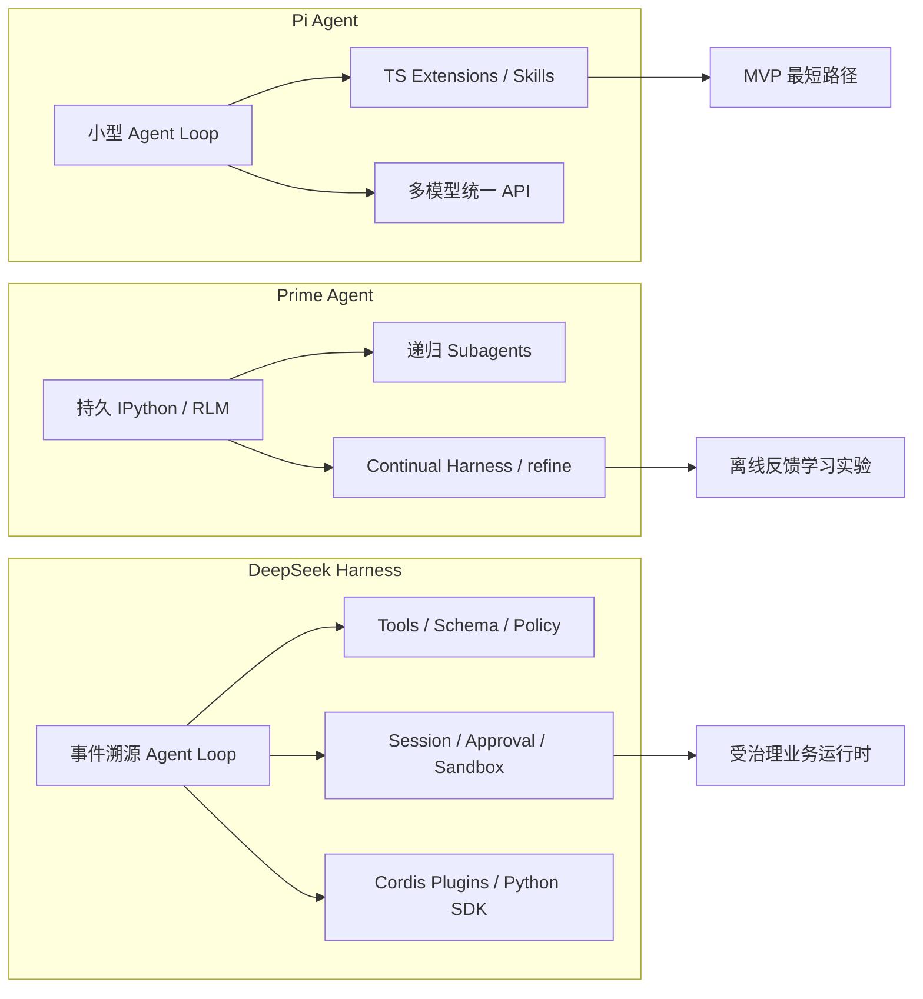
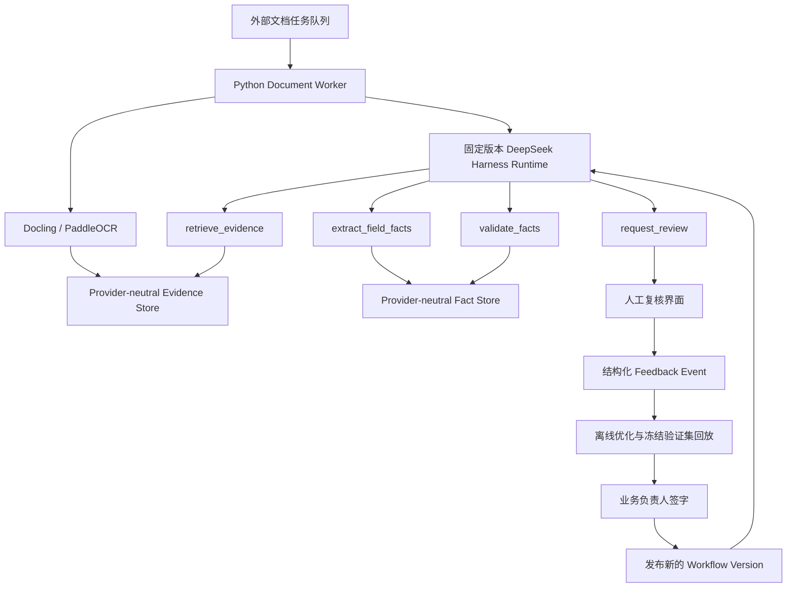

# Pi Agent、Prime Agent 与 DeepSeek Harness 技术比较

调研日期：2026-08-21  
适用项目：金融 PDF 42 字段抽取、证据审计、人工复核与反馈优化  
资料范围：仅使用项目官方仓库、官方文档、官方博客及源代码；未采用第三方测评或媒体文章

## 结论摘要

如果必须为整个业务工作流选择一个统一的 Agent Harness，**DeepSeek Harness 是三者中结构上最适合的目标底座**：它已经把 agent loop、工具、JSON Schema、事件溯源 session、JSONL/SQLite 持久化、人工提问、一次性审批、sandbox、反馈、OpenTelemetry 和 Python SDK 都设计成可替换能力。它最容易把“42 字段抽取 + 证据 + 人工复核 + 反馈”表达成受治理的业务运行时，而不是一段自由运行的 coding agent 会话。[官方架构](https://github.com/deepseek-ai/deepseek-harness/blob/master/docs/architecture.md)、[Session 数据面](https://github.com/deepseek-ai/deepseek-harness/blob/master/packages/session/README.md)、[人工协作面](https://github.com/deepseek-ai/deepseek-harness/blob/master/packages/interaction/README.md)

但这不是无条件结论：DeepSeek Harness 官方明确标为 **developer preview**，会发生破坏性变更。因此推荐方式是“**固定 commit/内部发行版 + 薄业务插件 + 外部任务队列**”，先做可退出的 12 字段纵向 PoC；不能直接跟随 `master` 上生产。[官方 README](https://github.com/deepseek-ai/deepseek-harness#developer-preview)

三者的最合适定位是：

| 目标 | 最合适候选 | 判断 |
|---|---|---|
| 最快做出简单 MVP | **Pi Agent** | 核心小、模型适配广、扩展直接；但审计、审批和 sandbox 需要另补 |
| 受监管的统一业务 Harness | **DeepSeek Harness** | 事件溯源、审批、sandbox、反馈和可替换能力最完整；主要风险是预览期兼容性 |
| 长任务、自主研究、反馈驱动的 Harness 实验 | **Prime Agent** | RLM + Continual Harness 最强；但模型生成 Python、自我改写状态和本地 daemon 不适合直接控制金融生产主链路 |

三者都不是百万 PDF 的分布式批处理调度器。它们最多处理单个/少量 agent 的循环、工具并发或本机子 agent；`1k/10k/1m` 文档的队列、租约、背压、GPU 池、重试和弹性扩缩容仍需外部执行平面。统一的应是**业务状态、工具契约、证据格式、审批和审计事件**，不是强迫一个 Harness 进程承担整个集群调度。

## 名称与范围消歧

### Pi Agent

本文的 Pi 指当前官方仓库 [`earendil-works/pi`](https://github.com/earendil-works/pi)。官方将其定义为 Pi Agent Harness，包括 `pi-agent-core`、统一模型 API `pi-ai`、coding agent CLI、TUI 与 telemetry；旧 `badlogic/pi-mono` 已不是本文采用的项目身份。[官方仓库说明](https://github.com/earendil-works/pi#pi-agent-harness)

### Prime Agent

本文的 Prime Agent 指 [`PrimeIntellect-ai/prime-agent`](https://github.com/PrimeIntellect-ai/prime-agent)，即 Prime Intellect 的 RLM-native coding/research agent。它建立在 Pi 之上，但加入持久 IPython、递归 agent、本地 daemon、kernel snapshot 和 Continual Harness。[官方 README](https://github.com/PrimeIntellect-ai/prime-agent#prime-agent-a-self-improving-rlm-agent)

需要排除两个同名语境：

- [`PrimeIntellect-ai/verifiers`](https://github.com/PrimeIntellect-ai/verifiers) 是训练/评测 environment 与 rollout harness；其 custom harness 用于启动并截获一个被评测程序，不是生产业务运行时。[官方 Custom Harness 指南](https://github.com/PrimeIntellect-ai/lab-cookbook/blob/main/guides/12-custom-harnesses/README.md)
- [`PrimeIntellect-ai/rlm-harness`](https://github.com/PrimeIntellect-ai/rlm-harness) 的官方组织描述是“Only for RL training”，不作为本项目候选。

### DeepSeek Harness

本文的 DeepSeek Harness 指 DeepSeek AI 官方项目 [`deepseek-ai/deepseek-harness`](https://github.com/deepseek-ai/deepseek-harness)，简称 `dsh`。它是 Cordis 驱动、everything-is-a-plugin 的通用 Agent Harness；不是 DeepSeek 模型 API，也不是第三方 agent 项目目录。[官方 README](https://github.com/deepseek-ai/deepseek-harness)

## 总体比较矩阵

| 维度 | Pi Agent | Prime Agent | DeepSeek Harness |
|---|---|---|---|
| 原生定位 | 极简、可嵌入的 Agent runtime 与 coding agent | 长任务、自主 coding/research 的 RLM Harness | 可组合、可替换的 Agent Harness 平台 |
| Agent loop | `AgentMessage → transformContext → convertToLlm → LLM/tool loop`；事件流清楚 | 模型只见持久 IPython，其他能力作为 Python 函数；TS host 仍拥有 provider/session/child lifecycle | turn/step/event 明确定义；agent interface 与具体 loop 分离，loop 可替换 |
| 模型适配 | 三者最直接；多 provider、OpenAI-compatible、国产模型目录较全 | 继承 Pi；官方表列 DeepSeek、ZAI、Kimi，当前表未直接列 Qwen | 原生 DeepSeek adapter + `pi-ai` adapter + custom provider；provider/model 都写入日志 |
| Tools / Skills | TypeBox tools、TS extensions、Agent Skills、Pi package | 单一 `ipython` 工具；Python-backed skills、MCP、subagents、TS extensions | Tool registry、JSON Schema、pre/execute/post pipeline、skills provider、MCP 可组合 |
| 结构化输出 | 工具参数可 schema；strict 受 provider/model 支持限制 | Harness 不提供业务最终输出 schema；适合在 Python 内用 Pydantic | 工具输入和 canonical output 都执行 JSON Schema；workflow/subagent 可要求 object-root 输出 |
| Session / checkpoint | Core 有可插拔 SQLite backend；coding agent 常用树形 JSONL | JSONL + kernel snapshot + daemon/worker 恢复；适合长会话 | append-only event log；JSONL/SQLite；语义 checkpoint 和 replay 更适合审计 |
| HITL | steering/follow-up；审批通常靠 extension | steering、队列、重新附着；`/refine` 是学习动作，不是业务审批 | typed user-question + one-shot approval；问答/决定可暂停 loop，审批审计成对记录 |
| 反馈优化 | 需自建反馈表和优化器 | 原生 Continual Harness `/refine`，可改 prompt/memory/skill/subagent state，并可回滚 | 原生记录 human feedback；没有自动改 Harness 的内置生产闭环，需业务插件实现 |
| Eval / observability | 事件订阅、token/cost；有 vendor-neutral telemetry contract，但无内置字段评测 | session stats、trace sharing、autonomous gate；可配 Prime Verifiers，但属另一个系统 | session telemetry + OTel + feedback；官方 BENCHMARK 入口很薄，42 字段评测仍需自建 |
| Sandbox / security | 官方明确无内置权限系统；需容器或外部 sandbox | 官方明确 worker/kernel 不是 security sandbox，执行模型生成 Python 和命令 | 本机 process sandbox、审批与 permission preset；无法执行要求的 sandbox 时 fail closed |
| 并发 / 分布式 | 同一轮工具可并行；无分布式任务队列 | 本机递归 subagent、后台 agent、daemon；不是集群批调度 | 并行安全工具调用、多 session、SDK；默认 `jobs-local` 只在进程内存中保存记录，不排队且重启即丢失 |
| 语言生态 | TypeScript / Node.js | TypeScript host + Python/IPython runtime | TypeScript/Cordis 主体 + Python subprocess SDK |
| 扩展复杂度 | 低 | 中到高；运行模型与状态面较特殊 | 高；插件粒度细、能力 seam 多 |
| 许可与成熟度 | MIT；活跃，API 面相对直接 | MIT；活跃但产品很新 | MIT；活跃，但官方明确 developer preview / breaking changes |
| 本项目主要风险 | 需要自行补齐治理面；TS/Python 跨进程 | 自我修改的治理、执行任意 Python、会话语义不等于文档作业状态 | 预览期升级成本、Cordis 学习成本、可能过度工程化 |

## 逐项核验

### 1. 架构与 Agent Loop

#### Pi Agent

`pi-agent-core` 是一个有状态 Agent，负责工具执行和事件流。消息在每次请求前可经过 `transformContext`，再通过强制的 `convertToLlm` 转换为模型消息；工具调用后 loop 自动继续。工具批次默认可并行，也可按工具或全局改为顺序执行；`beforeToolCall`/`afterToolCall` 可拦截和改写结果。[Agent Core 官方文档](https://github.com/earendil-works/pi/blob/main/packages/agent/README.md)

优点是控制面小，容易把 `parse_page`、`retrieve_evidence`、`extract_fields`、`validate_facts` 注册成工具。缺点是 workflow 生命周期、业务状态、审批、审计都不是一等领域对象，最终会由本项目自己写。

#### Prime Agent

Prime 把“工具列表”收束成一个持久 IPython kernel。模型在 Python 中调用文件、命令、skills、MCP 与 `rlm(...)` 子 agent；TypeScript host 仍拥有模型调用、session、调度和子 agent 生命周期。[官方 Usage](https://github.com/PrimeIntellect-ai/prime-agent/blob/main/packages/coding-agent/docs/usage.md#design-principles)

这种 RLM 设计适合超长上下文和开放任务：模型可以把上下文保存在变量中、用代码处理数据、并行 fan-out 子 agent。[Prime 官方发布说明](https://www.primeintellect.ai/blog/prime-agent) 对固定 42 字段生产链路而言，它也引入了一个新的可变执行层：每次提取都可能运行不同 Python 程序，重放和静态审计比受限工具调用困难。

#### DeepSeek Harness

DeepSeek Harness 将 session、system prompt、tools、agent interface、agent loop 和 LLM adapter 分成独立插件。一个 step 是一次模型调用及其工具执行；一个 turn 包含零到多个 step。关键输入、模型请求、输出、工具调用和结果都写入 durable session event，运行中的拦截则通过 Cordis event waterfall 完成。[官方架构与 turn flow](https://github.com/deepseek-ai/deepseek-harness/blob/master/docs/architecture.md#turn-flow)

这种结构最容易把业务规则分成：确定性工具、运行政策、事件记录、人工通道和外部适配器；代价是要理解 Cordis 的 service/provider/consumer、fiber、scope 和 plugin composition。

### 2. 模型与协议适配

#### Pi Agent

`pi-ai` 提供统一 provider/model 目录，官方文档列出 DeepSeek、ZAI、Moonshot/Kimi、Qwen Token Plan，以及任意 OpenAI-compatible API；并提供 provider 差异兼容参数。[Pi AI provider 列表](https://github.com/earendil-works/pi/blob/main/packages/ai/README.md#supported-providers)、[OpenAI-compatible 配置](https://github.com/earendil-works/pi/blob/main/packages/ai/README.md#custom-openai-compatible-providers)

因此在 Qwen/DeepSeek/Kimi/GLM 之间做盲测，Pi 的接入阻力最低。

#### Prime Agent

Prime 基于 Pi 的模型层。官方 provider 表当前明确列出 DeepSeek、ZAI 与 Kimi For Coding，也允许 OpenRouter 等路由；表中没有直接列出 Qwen provider，因此 Qwen 需要通过已支持网关或新增 provider 验证，不能先假定无差异兼容。[Prime provider 官方表](https://github.com/PrimeIntellect-ai/prime-agent/blob/main/packages/coding-agent/docs/providers.md#api-key-providers)

#### DeepSeek Harness

DeepSeek Harness 有原生 DeepSeek adapter，也有基于 `pi-ai` 的多 provider adapter。Web 配置允许 Anthropic/OpenAI 等 catalog provider，也允许以 `base URL + protocol + model` 添加公司网关或自部署模型。provider 和 model 会一起写入 request/session，支持以后重放和归因。[官方模型配置](https://github.com/deepseek-ai/deepseek-harness/blob/master/docs/user/guide/providers.md)、[LLM adapter 设计](https://github.com/deepseek-ai/deepseek-harness/blob/master/docs/subsystems/llm-streaming.md)

本项目仍需在同一 evidence/schema/prompt 下实测四家模型，因为“能接入”不等于 tool calling、长上下文、JSON 稳定性和中文金融理解一致。

### 3. Tools、Plugins 与 Skills

Pi 的 tool 参数使用 TypeBox；extension 可以添加/替换工具、命令、UI、compaction、permission gate、MCP 和 sandbox 连接；Agent Skills 遵循 `SKILL.md` 发现机制，Pi package 可把 extension/skills/prompts 一起分发。第三方扩展以宿主权限执行，官方要求安装前审查。[Pi Extensions/Skills](https://github.com/earendil-works/pi/blob/main/packages/coding-agent/README.md#customization)

Prime 延续 Pi extension/skill 机制，并加入 Python-backed skill：`SKILL.md + pyproject.toml + Python package` 会导入持久 IPython。这与 Docling/PaddleOCR 的 Python 生态天然相连。[Prime Python-backed Skills](https://github.com/PrimeIntellect-ai/prime-agent/blob/main/packages/coding-agent/docs/skills.md#python-backed-skills)

DeepSeek Harness 的 model-facing tool 有统一 pre/execute/post/result pipeline，工具注册、restriction、timeout、并发安全判断、展示与 structured output 都是插件能力；Skills 又分 registry、filesystem provider 和 model-facing consumer，因此可以替换为本地、内嵌或远端 catalog。[DSH Tools](https://github.com/deepseek-ai/deepseek-harness/blob/master/docs/subsystems/tools.md)、[DSH Skills](https://github.com/deepseek-ai/deepseek-harness/blob/master/docs/subsystems/skills.md)

### 4. Structured Output

Pi 支持工具 JSON Schema，并允许 `strict: prefer|require` 请求 provider-side constrained sampling。官方明确列出的 strict 支持包括 OpenAI、Anthropic、部分 Bedrock、Mistral 和 Gemini 3；当前说明没有把 Qwen、DeepSeek、Kimi、ZAI 列入该组。因此四家国产模型必须由本地 Pydantic/JSON Schema 再校验，`strict: prefer` 只能当优化而不是保证。[Pi constrained sampling](https://github.com/earendil-works/pi/blob/main/packages/ai/README.md#constrained-sampling-for-tools)

Prime 的模型侧主要只看 `ipython` 调用，JSON event/RPC 模式只是 Harness 事件传输格式，不是 42 字段最终答案 schema。[Prime JSON mode](https://github.com/PrimeIntellect-ai/prime-agent/blob/main/packages/coding-agent/docs/json.md) 生产抽取必须让 IPython 内的确定性 Python 代码/Pydantic 生成和校验 `FieldFact`，不能依赖自然语言末条回复。

DeepSeek Harness 对工具参数和 canonical output 使用同一 JSON Schema 子集，运行时拒绝非法参数或非法输出；caller-defined workflow/subagent structured output 可要求 object-root schema。[DSH JSON Schema contract](https://github.com/deepseek-ai/deepseek-harness/blob/master/docs/subsystems/tools.md#the-unified-json-value-schema-dsl) 这是三者中最接近业务事实契约的原生能力，但仍需把金融金额、日期、证据引用和状态枚举定义成项目自己的 schema。

### 5. Session、State 与 Checkpoint

Pi coding agent 默认把 session 保存为有 parent/child 树的 JSONL，可 resume、fork、clone、import/export；agent core 另有可插拔 SQLite session backend。[Pi Sessions](https://github.com/earendil-works/pi/blob/main/packages/coding-agent/README.md#sessions)、[Pi Agent Core SQLite backend](https://github.com/earendil-works/pi/blob/main/packages/agent/README.md#sqlite-session-backends) 这些是对话/session 状态，不应直接充当文档 job 的唯一账本。

Prime 将 JSONL transcript 与 IPython kernel snapshot 一起管理。后台 daemon 拥有 live sessions；worker 崩溃后可从 session JSONL 和 kernel snapshot 恢复，TUI 断开不终止 agent。[Prime 官方架构](https://www.primeintellect.ai/blog/prime-agent#prime-agents-architecture) 这适合长任务，但 kernel snapshot 可重现的是运行环境，不天然等于每一页、每个字段、每个证据的幂等状态。

DeepSeek Harness 的 `Session` 是 typed、append-only、event-sourced log，模型历史由日志重新派生；JSONL/SQLite 是持久化 backend，checkpoint policy 在模型请求和工具边界执行 durability barrier。[DSH Sessions](https://github.com/deepseek-ai/deepseek-harness/blob/master/docs/subsystems/session.md)、[DSH persistence family](https://github.com/deepseek-ai/deepseek-harness/blob/master/packages/session/README.md) 它最适合追加本项目的 `document/accepted`、`page/parsed`、`fact/proposed`、`fact/reviewed`、`workflow/released` 等不可变事件。

风险是当前 DeepSeek Harness 仍处预发布期；其仓库说明 on-disk session format 尚无兼容承诺。因此生产必须固定版本，并把可迁移的业务事实同时存入独立、供应商无关的数据表/JSONL，不能只保存 Harness 私有 session 文件。[官方 pre-release 说明](https://github.com/deepseek-ai/deepseek-harness/blob/master/AGENTS.md#pre-release-stance-foundation-over-blast-radius)

### 6. 人工复核与反馈学习

Pi core 支持在工具运行期间加入 steering message，以及完成后的 follow-up queue；permission/HITL 通常通过 extension 实现。[Pi steering/follow-up](https://github.com/earendil-works/pi/blob/main/packages/agent/README.md#steering-and-follow-up) 它没有现成的金融字段复核对象。

Prime 同样支持 steering、follow-up、后台 session 重连，并有 Continual Harness `/refine`：根据 trajectory 对 supplemental prompt、memory、skill 和 subagent spec 做小型、可回滚变更；基础 system prompt 不会被重写。[Prime README](https://github.com/PrimeIntellect-ai/prime-agent#built-for-long-running-work)、[refinement 源码契约](https://github.com/PrimeIntellect-ai/prime-agent/blob/main/packages/coding-agent/src/core/refinement/refinement.ts) 这是三者中最强的内建“反馈后改 Harness”能力。

但 `/refine` 的对象是 agent 行为资产，不是已经验证的业务模型版本。金融生产不能把一次人工纠正直接变成全局 prompt/skill 更新。需要额外门禁：结构化 reason code → 错误归因 → 候选修改 → 冻结验证集回放 → 质量/成本/拒答门槛 → 业务数据负责人签字 → 灰度发布。

DeepSeek Harness 提供两种更适合受治理流程的原语：

- `userQuestions` 可以暂停 tool/loop，等待单选、多选或自定义文本，再以正常 tool result 恢复。[User Question API](https://github.com/deepseek-ai/deepseek-harness/blob/master/packages/interaction/user-questions/README.md)
- `userApproval` 只允许一次性 `allowed-once`，否则 fail closed，并把 `approval/asked` 与 `approval/decided` 成对写入 session audit。[Approval seam](https://github.com/deepseek-ai/deepseek-harness/blob/master/docs/subsystems/approval.md)

它还提供 canonical session feedback event 和 message feedback sidecar，但这些反馈默认不进入模型对话，也不会自动修改 Harness。[Feedback packages](https://github.com/deepseek-ai/deepseek-harness/blob/master/packages/feedback/README.md) 这正适合金融治理：先记录事实，再由离线优化器提出改动。

### 7. Evaluation 与 Observability

Pi 可订阅详细 agent/tool events；`pi-telemetry` 提供 vendor-neutral span/schema contract、内存 adapter 和适配 OpenTelemetry/Sentry 的接口，但不内置 exporter，也不是字段准确率评测框架。[Pi Telemetry](https://github.com/earendil-works/pi/blob/main/packages/telemetry/README.md)

Prime 提供 `/usage`、session stats、可选 trace sharing 和 autonomous quality gate；官方也把 Prime Agent 用于 research evaluation，但训练/批量评测能力主要在独立的 Prime `verifiers` 项目中。[Prime Usage](https://github.com/PrimeIntellect-ai/prime-agent/blob/main/packages/coding-agent/docs/usage.md)、[Prime Verifiers](https://github.com/PrimeIntellect-ai/verifiers)

DeepSeek Harness 的 session telemetry 可捕获/重放 canonical session log，通过可替换 backend 发送；官方有 OTel backend，并支持 `FULL`、`FEEDBACK_ONLY`、`DISABLED`。默认关闭外发；启用时部署方必须自己配置 redaction，官方明确说明未挂载规则时可能包含消息、工具参数/结果和路径。[DSH Session Telemetry](https://github.com/deepseek-ai/deepseek-harness/blob/master/docs/subsystems/session-telemetry.md)、[CLI telemetry stance](https://github.com/deepseek-ai/deepseek-harness/blob/master/apps/cli/reference/README.md#shared-deployment-behavior)

三者都不能替代本项目自己的评测：字段值准确率、证据页/段落准确率、状态准确率、拒答率、人工修改率、每文档成本、P95 延迟和不可恢复失败率仍要用 `gold.jsonl` 与固定回放程序计算。

### 8. Sandbox 与安全

Pi 官方明确说明没有内置文件系统、进程、网络或凭据权限系统，默认继承启动用户权限；需要 Gondolin、Docker、OpenShell 或其他外部隔离。[Pi Permissions & Containerization](https://github.com/earendil-works/pi#permissions--containerization)

Prime 官方同样明确：worker/kernel 只提供生命周期隔离和恢复，不是 security sandbox；它会以用户权限执行模型生成的 Python 和项目命令。[Prime Security Warning](https://github.com/PrimeIntellect-ai/prime-agent#getting-started) 对“不允许全文外发”的金融环境，还必须独立限制网络目的地、文件读取范围、凭据和 Python package 安装。

DeepSeek Harness 内置 process-sandbox seam，支持 `read-only`、`workspace-write`、`danger-full-access`，本机实现包括 Linux bwrap/Landlock 和 macOS Seatbelt；请求的隔离无法执行时会 fail closed，而不是静默无隔离运行。[DSH Sandbox](https://github.com/deepseek-ai/deepseek-harness/blob/master/packages/sandbox/sandbox/README.md) 这是三者中最好的默认安全基础，但它仍是 same-world process confinement，不是容器、microVM 或网络数据防泄漏方案。

因此无论选谁，生产还需要：默认断网/域名 allowlist、获批模型 endpoint、全文不外发、只发送必要 evidence fragment、凭据引用、审计留痕、运行镜像固定和依赖供应链扫描。

### 9. 并发、批处理与分布式能力

Pi 的内建并发是单次 agent 内工具批次并发；Prime 增加本机递归 subagents、后台 agent 和 daemon；DeepSeek Harness 支持被标记为 concurrency-safe 的工具并行，以及多个独立 session/SDK runtime。[Pi tool execution](https://github.com/earendil-works/pi/blob/main/packages/agent/README.md#with-tool-calls)、[Prime subagents](https://github.com/PrimeIntellect-ai/prime-agent/blob/main/packages/coding-agent/docs/usage.md#agents-and-recursive-subagents)、[DSH tool concurrency contract](https://github.com/deepseek-ai/deepseek-harness/blob/master/docs/subsystems/tools.md)

DeepSeek Harness 当前默认 `jobs-local` provider 是明确的 **process-local** 实现：job record 只保存在内存中，默认每 owner 最多 10 个并发；它不提供队列或抢占，Harness 进程退出后 job record 消失。官方说明 durable/cross-restart execution 需要另一个 backend。[DSH jobs-local](https://github.com/deepseek-ai/deepseek-harness/blob/master/packages/jobs/jobs-local/README.md) 因而不能把 `ctx.jobs` 当作 1k/10k/1m 文档调度系统。

这些机制都没有提供文档批处理所需的集群级：任务分区、visibility timeout、租约续期、dead-letter queue、GPU 配额、tenant fairness、跨机背压与百万文档 backfill。DeepSeek Harness 官方 benchmark 说明也要求独立 benchmark task 使用独立 workspace 和 session id，并未声称提供集群调度器。[DSH BENCHMARK](https://github.com/deepseek-ai/deepseek-harness/blob/master/BENCHMARK.md)

## 针对本项目的适配判断

### 业务能力映射

| 本项目需要 | Pi Agent | Prime Agent | DeepSeek Harness |
|---|---|---|---|
| Docling/PaddleOCR Python 集成 | 需 TS→Python worker/RPC | **最直接**，IPython/Python skill | 有官方 Python SDK，但 runtime 仍是 TS subprocess；建议 Python worker 作为 tool backend |
| 42 字段和 Evidence schema | 自建 | 用 Pydantic 自建 | 可复用 tool output JSON Schema，再由 Pydantic二次验证 |
| 报告名/页码/表格或段落证据 | 自建业务 store | 自建业务 store；不能只靠 kernel state | 最适合追加业务 session event，但仍应另存 provider-neutral Evidence/Facts |
| 人工逐字段复核 | 需 extension/UI | 可交互但要建字段 UI | typed question/approval 可承载等待；字段复核 UI 仍要开发 |
| 人工反馈优化 workflow | 自建离线循环 | `/refine` 原生，但必须增加评测/审批门禁 | 记录反馈强，优化器需另建；治理边界最清楚 |
| 不允许全文外发 | 依赖外部 sandbox/network policy | 依赖外部 sandbox/network policy | 内建 process sandbox 更好，但网络/DLP 仍要外部控制 |
| 1k/10k/1m 并发 | 外部队列 | 外部队列；不应用 subagent 代替任务队列 | 外部队列；每个 worker 可跑固定版本 DSH runtime |
| 低时延确定性抽取 | 轻、合适 | RLM/递归可能增加延迟和方差 | 可通过 preset 禁用不需要的 agent 能力；runtime 较重，需要压测 |

### 最主要的适配风险

#### Pi Agent

1. 为补齐 session 业务事件、正式审批、sandbox、反馈和发布门禁，项目会逐渐重写 DeepSeek Harness 已有的能力。
2. 解析栈为 Python，主 Harness 为 TypeScript，需要定义清晰的 subprocess/RPC 边界。
3. Pi session 是 agent transcript，不足以承担 document/job/fact/evidence 的全部状态。

#### Prime Agent

1. 模型可执行任意 Python；自由度越高，抽取重放、延迟和成本方差越大。
2. Continual Harness 的自我修改若直接进入生产，会把偶发人工意见放大为全局行为变化。
3. 本机 daemon、worker、kernel 和递归 subagent 解决的是长会话持续运行，不是百万文档的分布式调度。
4. 若为满足金融治理而禁用自动 refine、限制 Python 和禁用自主 subagent，就削弱了选择 Prime 的主要理由。

#### DeepSeek Harness

1. developer preview 和 session format 无兼容承诺，是当前最大落地风险。
2. Cordis 全插件架构学习曲线陡；若每个业务函数都做成插件会过度工程化。
3. Python SDK 当前以 subprocess + JSON-RPC 驱动 runtime；高并发下不能为每页启动一个 runtime。
4. 反馈记录不会自动生成更优 workflow，需要另建离线归因、回放和发布门禁。

## 推荐的统一 Harness 方案

### 推荐：受限版 DeepSeek Harness

在“一定要统一 Harness”的前提下，建议选择 **DeepSeek Harness 的固定版本内部发行版**，只启用本项目需要的能力：

这里 Harness 统一四件事：

1. 每个 agent/document run 的状态与事件语义；
2. 工具、证据、字段和人工问答契约；
3. 模型/provider、权限、sandbox、预算和可观测性策略；
4. 反馈到 workflow version 的受控发布流程。

它不接管两件事：

1. Docling/PaddleOCR 的高吞吐 Python 执行；
2. 1k/10k/1m 规模下的分布式队列和 GPU/CPU worker 调度。

### 建议新增的业务设置

每次运行都必须把解析后的设置快照和 `workflow_version` 写入审计记录；以下设置保持供应商无关：

| 设置组 | 必需设置 | 目的 |
|---|---|---|
| Workflow | `workflow_version`、字段契约版本、证据 schema 版本 | 可重放、可回滚、模型供应商解耦 |
| Data policy | `external_text=none/fragments/private_model`、允许域名、片段最大长度 | 落实全文不外发 |
| Page routing | 原生文本硬门槛、灰区双路、OCR fallback、表格策略 | 控制准确率/成本/延迟 |
| Model routing | provider/model、fallback、temperature、token budget、timeout | 四家模型盲测和按字段路由 |
| Tool policy | allowlist、并发安全、timeout、retry、sandbox mode | 限制 agent 自由度 |
| Extraction | 字段集合、候选证据上限、拒答条件、schema strictness | 控制 42 字段结构化抽取 |
| Validation | 金额/日期/比例规则、跨报告优先级、冲突阈值 | 确定性业务校验 |
| Review | 全量/抽样/异常复核、review reason codes、负责人 | 人工确认和责任边界 |
| Feedback | 是否仅记录、是否生成候选改动、验证集门槛、审批人 | 禁止在线自我修改生产 |
| SLO profile | `1k`、`10k`、`1m` 对应并发、队列、预算和 deadline | 不把吞吐策略写死进 agent prompt |
| Persistence | 业务 fact/evidence store、Harness session backend、retention | 区分业务事实与运行 transcript |
| Telemetry | 默认本地、redaction、采样、export endpoint | 避免敏感全文进入观测平台 |

### 对 Prime Continual Harness 的保留用法

不建议丢弃 Prime 的思路。可以把它作为**离线 Workflow Optimizer** 的参考或实验运行时：读取已脱敏的结构化反馈，聚类错误，提出规则/Prompt/检索改动候选，再交给冻结验证集和人工审批。不要让其直接修改生产 prompt、字段定义、Python skill 或全局 memory。

### 回退条件

若 PoC 发现以下任一情况，应回退到 Pi Agent，而不是继续扩展 DeepSeek Harness：

- 固定版本仍频繁出现 session/schema 兼容问题；
- Cordis 插件开发使 12 字段 PoC 明显慢于简单 TS/Python RPC；
- DSH runtime 的常驻内存或启动开销无法满足文档 worker 密度；
- 团队不愿维护固定版本或内部 fork。

回退后仍保留相同的 `Evidence`、`FieldFact`、`ReviewFeedback` 和 `WorkflowVersion` schema，以避免 Harness 锁定。

## 选择前必须完成的 PoC 验收

在没有验证集的当前阶段，不能凭框架功能表直接锁定。建议用已同意的 12 字段纵向切片构建首批 gold，并对 Pi 与固定版本 DSH 进行同任务对照；Prime 只参加离线反馈优化实验。

最低验收项：

1. 同一文档中断后可恢复，不能重复生成冲突 fact；
2. 每个值能定位到报告名、页码、表格/段落和 parser-owned bbox；
3. Qwen/DeepSeek/Kimi/GLM 切换不改变字段和证据 schema；
4. 人工修改产生结构化 reason code，并能重放到旧 workflow version；
5. 未获批时全文、工具参数和 telemetry 均不外发；
6. 100 个混合 PDF 的并发压测给出吞吐、P50/P95、失败率、GPU 利用率和每文档成本；
7. 候选 workflow 修改只有在冻结 gold 回放通过并由业务数据负责人签字后才能发布。

## 最终决策

**推荐顺序：DeepSeek Harness（受限、固定版本） > Pi Agent > Prime Agent。**

- 选择 DeepSeek Harness，是因为本项目优先级是审计、HITL、权限、证据和版本化，而不是 coding agent 的最大自主性。
- 保留 Pi 为现实回退路径，因为它更小、更稳定、更容易完成 MVP。
- Prime Agent 适合离线学习和长任务实验，不适合直接成为金融生产抽取主循环；其 Continual Harness 思路可以吸收，但必须受验证集和人工审批约束。

这个结论只选择 Harness 结构，不锁定模型供应商、OCR 引擎的最终路由或分布式队列产品。
