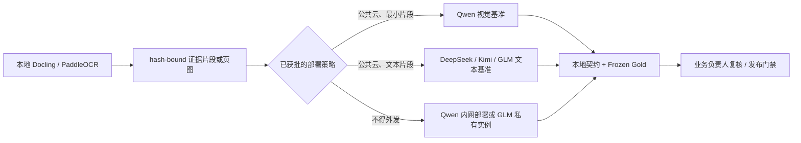

# Qwen、DeepSeek、Kimi 与 GLM 的模型路由调研

调研日期：2026-08-22  
范围：官方 API/部署文档；这是能力筛选，不是质量基准或采购报价。

## 结论

推荐把 **Qwen `qwen3.7-plus`** 作为云端视觉证据试点的第一基准，把 **DeepSeek `deepseek-v4-flash`** 作为低成本文本证据基准；Kimi `kimi-k3` 与 GLM `glm-5.2` 在同一冻结集上作为第二批对照。

更严格隔离时，优先级变为：Qwen 开源权重的内网部署，或在签约前确认 GLM 私有实例是否支持所选模型版本。所有选择均保持 provider-neutral：模型只能提出事实，hash-bound evidence、Pydantic 契约、frozen-gold evaluator 和业务负责人复核仍是唯一裁决者。

| 路由 | 适用性 | 官方能力事实 | 本项目限制 |
|---|---|---|---|
| **Qwen `qwen3.7-plus`** | 默认视觉证据试点 | 官方文档列出图像输入、1M context、function calling 与 structured JSON；北京 workspace-dedicated endpoint、PrivateLink/VPC 与专属吞吐是可选部署能力。[vision](https://www.alibabacloud.com/help/en/model-studio/vision-model) [structured output](https://www.alibabacloud.com/help/en/model-studio/qwen-structured-output) [PrivateLink](https://www.alibabacloud.com/help/en/model-studio/access-model-studio-through-privatelink) | 只送本地 OCR/解析后选定的页图或裁剪；结构化输出不替代本地验证。其 Qwen3 开源权重可按官方 vLLM/OpenAI-compatible 路径自部署。[self-hosting](https://github.com/QwenLM/Qwen3/blob/main/docs/source/deployment/vllm.md) |
| **DeepSeek `deepseek-v4-flash` / `deepseek-v4-pro`** | 文本证据、低成本/高质量对照 | V4 的官方 API 支持 JSON output、tool calls、1M context；Flash/Pro 公开并发上限分别为 2,500/500，且同时支持 OpenAI 和 Anthropic API 格式。[models/pricing](https://api-docs.deepseek.com/quick_start/pricing) [function calling](https://api-docs.deepseek.com/guides/function_calling/) [rate limit](https://api-docs.deepseek.com/quick_start/rate_limit) | 不把它假定为页面视觉模型；只评测本地解析后的有限文本片段。公共 API 不是私有部署或不外发安排的证据。 |
| **Kimi `kimi-k3`** | 长中文文本的第二云端基准 | Chat Completions 支持 function tools、`json_object` 与 `json_schema` structured output；官方模型 API 暴露当前模型的 context/image/reasoning flags，实际可用型号以 `/models` 为准。[chat](https://platform.kimi.com/docs/api/chat) [models](https://platform.kimi.ai/docs/api/list-models) | 默认策略下不送原始 PDF。客户应按官方隐私/模型使用条款审查商业秘密输入；公共 API 不应被解读为私有化。 [privacy](https://platform.kimi.com/docs/agreement/userprivacy) [terms](https://platform.kimi.com/docs/agreement/modeluse) |
| **GLM `glm-5.2`** | 文本证据与私有实例候选 | 官方文档列出 1M context、工具、cache/structured output；Chat API 支持 function calling 与 `json_object`。智谱还说明私有实例可提供专属计算、VPC/内网/allowlist 和水平扩缩。[GLM-5.2](https://docs.bigmodel.cn/cn/guide/models/text/glm-5.2) [chat API](https://zhipu-ef7018ed.mintlify.app/api-reference/%E6%A8%A1%E5%9E%8B-api/%E5%AF%B9%E8%AF%9D%E8%A1%A5%E5%85%A8) [private instance](https://docs.bigmodel.cn/cn/guide/tools/model-deploy) | 在采购前确认 `glm-5.2` 是否属于目标私有实例清单；文本旗舰模型不能被假定能理解 PDF 页面图。 |

## 生产决策

1. 初始 profile 禁用供应商原生 PDF/file-Q&A；它会绕过本地 hash、页码和片段审计。
2. 结构化输出是输入质量优化，不是正确性证明。DeepSeek JSON mode、Kimi JSON Schema、GLM JSON mode 与 Qwen structured output均必须经过既有事实/证据验证器。
3. 不把固定价格、吞吐或公开并发写死到生产参数。它们随区域、模型版本和合同变化；在 1k/10k/1m 档位前用真实 token/page 分布压测后再申请容量。官方价格和并发可作初筛参考：[Qwen pricing](https://www.alibabacloud.com/help/en/model-studio/model-pricing)、[DeepSeek pricing](https://api-docs.deepseek.com/quick_start/pricing)、[Kimi limits](https://platform.kimi.com/docs/pricing/limits)、[GLM rate guidance](https://docs.bigmodel.cn/cn/api/rate-limit)。

## 建议的 live benchmark 顺序

1. Qwen `qwen3.7-plus` 与 `qwen3.6-flash`：同一批准页图/固定 schema。
2. DeepSeek `deepseek-v4-flash`：同一文本片段，作为成本和吞吐对照。
3. Kimi `kimi-k3` 与 GLM `glm-5.2`：同一文本片段；前者须完成公有云数据审批，后者同时确认私有实例资格。
4. 以签署的 frozen-gold 输出决定路由：critical-field exact fact/evidence、false-fill、p95 延迟、单位文档成本、不可恢复失败率和部署合规性共同达标才可发布。

需要 API key 的唯一节点是上述真实调用。首先需要一份业务负责人签署的 gold JSONL；随后只需提供获批候选供应商中的一个 key，即可先跑单供应商基准，其他不受影响的本地工作继续进行。
