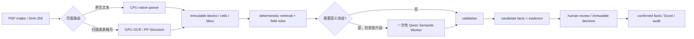

# ABS 数据 AI 采集：规模化与低延迟生产架构调研

调研日期：2026-08-28
范围：当前 NPL ABS PDF→带证据事实工作流从 demo 迁移到 1,000 / 10,000 / 1,000,000 份文档时的运行架构。本文不替换既有字段契约、证据契约或人工确认制度。

## 结论先行

生产化的关键不是把全部 PDF 交给一个“大模型服务”，而是把已经验证的 **确定性文档数据平面** 拆成可独立扩缩的资源池：CPU 原生解析、GPU OCR/表格、少量一次性语义映射调用，以及人工复核。生产默认采用**方案 A：确定性 Python workflow + 可选的一次性 Qwen Semantic Worker + 独立 ReviewDecision**，不运行 Agent loop。每个阶段以内容哈希和版本作为幂等键；非空事实仍必须引用 parser-owned 的段落或单元格证据。

当前项目最小、可演进的路线是：

1. 先冻结 MVP 的本地文件工件和 12-field 验收集，补齐逐阶段计时；不改为全量 LLM 抽取。
2. 到 1,000 份文档时，替换**运行与存储适配器**：对象存储 + 关系型元数据/审计库 + 一种持久队列 + 分开的 CPU/GPU worker。业务 schema、证据 ID、规则与 ReviewDecision 不变。
3. 到 10,000 份后，按 queue age 与资源池的实测服务率扩缩；交互任务和批量/历史回填任务隔离。
4. 只有达到百万级回填、需要跨集群重放或多团队订阅阶段事件时，才引入 Kafka 这类可分区事件日志；不要为了 demo 预先引入 Kafka、Flink、Ray 或 Kubernetes。

这与项目既有决策一致：MVP 已实现哈希准入、原生/OCR 路由、不可变 evidence/fact、确定性验证、Excel 导出和人工 ReviewDecision；模型只处理少量“证据与业务字段的语义对应”，且默认不允许全文外发。

## 1. 当前 demo 的事实边界

### 已经能够复用的能力

- 实际样例（10 PDF、832 页）已完成原生解析、OCR、字段规则、fact/evidence 工件和 Excel 导出；Field 39 已以 PP-StructureV3 在真实 p112–113 表完成单元格级证据。
- 当前批次输出 71 个 candidate facts，覆盖 22/42 个逻辑字段契约；本轮 MVP 的 12 个 vertical-slice 字段都在统一候选批次中。它不是 42 字段准确率结论，也不是生产容量基准。
- PP-StructureV3 的官方结果确实包含 `table_res_list`、`pred_html`、`table_ocr_pred.rec_texts`、`rec_boxes` 与 cell boxes，适合归一化为项目的 row/column/cell evidence；不能把它的 HTML 或 OCR 文本直接当业务事实。[PaddleOCR PP-StructureV3 输出契约](https://github.com/PaddlePaddle/PaddleOCR/blob/main/docs/version3.x/pipeline_usage/PP-StructureV3.en.md)
- 在人工初审草稿中，当前 12 类字段的 55 条 candidate 均被标为 `accept`。这是单一 bundle 的初审一致性（55/55），不是独立金标上的统计准确率、召回率或自动确认授权。

### 当前尚不能声称的能力

- 当前样例是开发数据，尚无按产品 bundle 切分的冻结验证集；不能据此承诺 42 字段准确率或自动确认。
- 本机 warm sequential 的端到端计时只能说明单机 demo 服务时间，不能代表排队延迟、并发吞吐、模型供应商延迟或生产 P95。
- 人工草稿尚须由业务数据负责人用现有 CLI 追加不可变 `ReviewDecision`，才能形成 confirmed facts。

## 2. 业界可复用的设计模式与适用判断

| 模式 / 代表实现 | 官方事实 | 对本项目的采用判断 |
|---|---|---|
| 异步文档作业 + 完成通知 | AWS Textract 的多页 PDF/TIFF 采用 `Start`→job id→SNS/SQS 完成通知→`Get` 的异步模式；官方明确建议多文档时监听一个 SQS 完成队列，而不是逐 job 轮询 `Get`，以避免节流。其 `ClientRequestToken` 对相同 Start 请求复用 job id，而非重新执行。[AWS async operations](https://docs.aws.amazon.com/textract/latest/dg/api-async.html) | **采用模式，不绑定 Textract。** PDF/OCR worker 要以 job/stage 事件完成，而非同步 HTTP 长连接或 busy polling。 |
| 存储驱动的批处理 | Azure Document Intelligence batch 一次可处理至多 10,000 文件，并从 Blob 输入、向指定存储写结果；结果状态只保留 24 小时。[Azure batch analysis](https://learn.microsoft.com/en-us/azure/ai-services/document-intelligence/prebuilt/batch-analysis?view=doc-intel-4.0.0) | **采用持久化工件原则。** 不能依赖供应商短期 operation status 作为唯一证据或审计记录。 |
| 配额感知的 bulk / online 分流 | GCP Document AI 区分在线与 batch 配额；例如 batch 并发默认有每项目/区域限制，且 batch RPM 按文档数而非请求数计算。[GCP Document AI quotas](https://docs.cloud.google.com/document-ai/quotas) | **采用准入控制。** 模型/OCR 调用必须以 token、页数和 worker 资源限流，不能仅以“文档数量”限流。 |
| 本地文档服务的 Local→队列 worker 演进 | Docling Serve 支持单机 local engine，也支持 Redis/RQ 的 API 入队 + 独立 worker；提供 CPU/GPU、page batch、线程及离线 artifacts 配置。[Docling deployment](https://docling-project.github.io/docling/usage/api_server/deployment/) | **适合 1k/10k 的渐进式部署参考。** 当前 Python data plane 可继续直接运行；不必迁移到 Docling Serve 才能扩缩。 |
| GPU 资源隔离与队列驱动扩缩 | Ray Serve 能为每 replica 声明 GPU，按排队/进行中请求做 autoscaling，并以 `max_ongoing_requests` 限制单 replica 并发；官方建议以端到端 latency 目标压测调参。[Ray Serve autoscaling](https://docs.ray.io/en/latest/serve/autoscaling-guide.html) [resource allocation](https://docs.ray.io/en/latest/serve/resource-allocation.html) | **采用原则，暂不引入 Ray。** OCR/table 池是独立且有界的 GPU worker pool；实测表明容器/队列方案不能满足才评估 Ray。 |
| 分区有序事件日志 | Kafka 将相同 key 写入同一 partition，并保证该 topic-partition 的读取顺序；topic 可复制以提高容错可用性。[Kafka introduction](https://kafka.apache.org/documentation/) | **仅百万级或多消费者时采用。** 以 `document_sha256`/bundle key 分区可保持单文档阶段顺序；不追求“端到端 exactly-once”。 |
| 状态 checkpoint 的边界 | Flink 的 exactly-once checkpoint 只保证算子/用户函数状态；官方明确不保证对外部系统的 exactly-once 交互。[Flink checkpointing mode](https://nightlies.apache.org/flink/flink-docs-release-1.20/api/java/org/apache/flink/core/execution/CheckpointingMode.html) | **不要用口号替代设计。** 使用 at-least-once delivery + 内容哈希/版本幂等写入；外部模型、OCR、邮件等副作用需单独去重。 |

### 不建议直接采用托管 Document AI 作为主解析器

托管 Textract / Document AI 的异步模式、存储输入输出和配额控制很值得借鉴，但它们会改变数据驻留、原始证据 ownership 与供应商依赖边界。当前业务默认“不允许全文外发”，并且 Field 39 已验证 PP-Structure 的 cell-level 证据路径。因此推荐先把 PDF 解析/OCR 保留在受控环境；若未来采购托管 OCR，只能作为一个 parser adapter，其结果仍须归一化到本项目的 `document_sha256 + page + block/cell + exact_text + bbox` 契约。

## 3. 推荐生产数据平面

### 3.1 资源池与队列

| 队列 / worker 池 | 输入与限额单位 | 输出 | 为什么要拆开 |
|---|---|---|---|
| intake + native parse（CPU） | PDF / 页数 / CPU lease | page diagnostics、native blocks | 多数有文本层的页面不应占用 GPU OCR。 |
| OCR + table（GPU） | **页**、渲染像素、GPU lease | OCR blocks、table cells、bbox、OCR/model version | 表格和扫描页资源重，且应与 CPU 文档解析隔离。 |
| retrieve + deterministic extraction（CPU） | bundle / candidate blocks | candidate facts、规则版本 | 已验证的代码、金额、日期和公式不需要排队等模型。 |
| semantic mapping（一次性 Qwen Semantic Worker） | 最小 evidence 片段 / page crop、token、provider concurrency | proposal + request/response hash | 只处理歧义；不运行 Agent loop，供应商限流不能反压 OCR。 |
| validation + export（CPU） | fact set | validation、Excel projection | 可重放，且不得改变原始证据。 |
| review | task | append-only ReviewDecision | 人工等待不得计入机器 extraction latency。 |

每个 stage 的消息最少带 `document_sha256`、`bundle_id`、`stage`、`attempt`、`workflow/parser/OCR/rule/model version`、输入 artifact URI/hash 与提交时间。worker 只在输出 artifact 已成功持久化后 ack；重复投递根据同一内容哈希和版本读到已有成功输出即返回。这比全局事务或“exactly once”更直接，也符合现有 content-addressed runs 设计。

### 3.2 证据、隐私与审计

1. 原始 PDF、渲染页图和完整 block/cell 只进受控对象存储；元数据/事实/ReviewDecision 进入具备不可变审计字段的关系库。
2. 当且仅当字段语义消歧需要模型时，retriever 选择已有 evidence ID；egress policy 决定可发送的 exact text 或必要 crop。记录 provider、model snapshot、request hash、response hash、evidence IDs、token、耗时和审批依据；不把完整敏感 prompt 写进通用日志。
3. Docling 的设计支持本地模型且默认不共享用户数据；调用远端服务必须显式 opt-in，和本项目的“最小证据外发”政策相容。[Docling advanced options](https://docling-project.github.io/docling/usage/advanced_options/)
4. Qwen 是未来 semantic adapter 的候选，仍需沿用现有 provider-neutral contract：模型选择 evidence，不产生页码/bbox，不替代验证与人工签字。云端调用前须取得数据分级、目的地与最小片段授权；更严格场景改成私有化模型，而不是放宽 evidence 校验。

默认实现停留在方案 A：确定性 retriever 在调用前选好 evidence IDs，Semantic Worker 只接收获批 evidence、字段 schema、prompt hash 和 token budget，完成一次结构化请求后结束；服务端校验 evidence ID 与 exact quote，再写入 proposed candidate。

只有冻结验证集和真实 failure case 证明“一次性调用因证据不足而失败，且模型必须自己多轮调用证据工具才能显著提高字段或证据质量”，才尝试方案 B（最多 2–3 轮、仅开放 `retrieve_evidence`、`validate_facts`、`request_review` 的自建 bounded loop）或 Pi Agent Core。升级时必须同时比较准确率、证据完整性、false fill、P95、token 成本和运行故障率；未证明净收益时继续使用方案 A。

### 3.3 可观测性与验收指标

至少按 **stage × 路由（native/OCR/hybrid）× 文档族 × 服务/排队时间** 打点：

- intake/parse/OCR/retrieval/model/validation/export 各自 P50/P95/P99；另记 queue age，不能把排队混为“模型慢”。
- 每页 native→OCR 路由比例、OCR page rate、table cell 产出与 fail-closed 原因。
- candidate/confirmed count、evidence completeness、false fill、cross-entity leakage、未解决冲突、review rate 与 review turnaround。
- 重试、dead-letter、重复命中缓存、模型 token/latency/cost、每个 worker 的 CPU/GPU 利用率与显存。

既有知识库的正确原则是：按阶段和 percentile profile，而不是用平均端到端时间掩盖资源饱和；队列时间单列，才能判断是容量不足还是服务变慢。

用 OpenTelemetry 的 trace、metric、log 三类信号把同一 bundle/stage/attempt 串起来即可；其 context propagation 可把 trace/span ID 写入日志，避免另造一套关联 ID。[OpenTelemetry signals](https://opentelemetry.io/docs/concepts/signals/) [OpenTelemetry context propagation](https://opentelemetry.io/docs/concepts/context-propagation/)

## 4. 容量档位与落地路径

以下页数估算仅以当前样例为种子：83.2 页/文档、OCR 页占比约 3.97%。生产必须在真实分层分布（文档页数、扫描比例、复杂表格数、候选 token）上重测。`worker_count = ceil(required_rate / measured_worker_rate × headroom)`；初始 headroom 取 2×，直到压测证明更合适的值。

| 档位与目标 | 由样例外推的最低平均页率 | 最小实现 | 什么时候进入下一档 |
|---|---:|---|---|
| 现在：MVP | 不设吞吐 SLA | 本地 `extract-folder`、content-addressed artifacts、人工确认 | 12-field 金标/签字、分阶段基线完成。 |
| 1,000 / 4 小时 | 5.78 page/s；约 0.23 OCR page/s | 对象存储替代 runs 主存储；关系库记录 document/stage/fact/review；一类 durable queue；CPU 与 GPU worker 分池；简单固定并发与 dead-letter。 | 在目标负载下，文本 P95 ≤120s、OCR-heavy P95 ≤300s，且 evidence/field 质量门通过。 |
| 10,000 / 24 小时 | 9.63 page/s；约 0.38 OCR page/s | 与 1k 相同数据模型，新增 interactive 与 batch 两个 priority class、queue-age autoscaling、模型 token/concurrency 限流、容量预热和日常 replay。 | 批处理与交互混跑仍满足单文档 P95；可从指标证明瓶颈在特定池。 |
| 1,000,000 / 30 天 | 32.10 page/s；约 1.27 OCR page/s | 多可用区对象存储/数据库；分区 stage event log（仅此时评估 Kafka）；按文档 hash 分区；独立 backfill 配额与 GPU pool；跨区域/灾备按监管要求设计。 | 连续 soak、故障重试和回放均保持幂等，且不影响线上交互流。 |
| 稳态增量 100,000/天 | 96.30 page/s；约 3.82 OCR page/s | 在百万级能力上按峰值到达率和季节性预留，不以日均替代峰值；模型调用 pool 单独预算。 | 由真实 arrival distribution、页数和 token 分布确定合同容量。 |

### 分三步实施（避免先建平台）

**Step A — 在当前仓库完成可量化基线。** 冻结 12-field MVP 与 review 结果；为现有命令记录 stage duration、page/OCR/table/token 计数、失败码和 artifact hash；建立按产品 bundle 的 gold set；用一个真实语义歧义案例验收一次性 Qwen Semantic Worker。此步不需要新队列、数据库、Agent harness 或 API。

**Step B — 1,000 档部署。** 先选择企业既有云/内网标准组件，不自建平台：一个对象存储、一个关系库、一个队列、容器化 CPU/GPU worker。迁移只替换工件落点和调度触发，现有 JSONL/EvidenceRef/ExtractionFact/ReviewDecision 和规则版本不变。以回放真实 PDF 分布的压测决定 worker 数；不要按本文公式直接采购。

**Step C — 10,000 / 1,000,000 档扩展。** 先实施 priority isolation 和 queue-age 自动扩缩，再根据实测选择是否需要 Ray（GPU serving/复杂弹性）或 Kafka（分区事件/多消费者）。Flink 只在出现真正的长生命周期 stateful stream 计算需求时评估；目前文档 stage DAG 不需要它。每次变更均须用冻结 gold replay 证明没有降低 value/evidence/false-fill 指标。

## 5. 需要在方案评审中明确的决策

1. **部署边界：** CPU/GPU parser 是否均在内网；若是，模型 egress 的获批范围是 text block、page crop，还是零外发/私有模型。
2. **优先级：** 哪些任务属于交互/时效性任务，哪些属于可抢占的历史回填；必须由业务给出，而不是由队列猜测。
3. **质量门：** 业务数据负责人签署的产品级 gold set、关键字段和 false-fill 阈值；没有它就不能从“初审 55/55”推导自动确认。
4. **容量输入：** 真实日/峰值 arrivals、页数、扫描页、复杂表格、候选 token 与审核量分布；没有它，任何节点/GPU 数量都只是演示估算。

## 参考来源

- [AWS Textract：异步多页文档与通知队列](https://docs.aws.amazon.com/textract/latest/dg/api-async.html)
- [Azure Document Intelligence：batch analysis](https://learn.microsoft.com/en-us/azure/ai-services/document-intelligence/prebuilt/batch-analysis?view=doc-intel-4.0.0)
- [Google Cloud Document AI：配额](https://docs.cloud.google.com/document-ai/quotas)
- [Docling Serve：deployment 与 compute engines](https://docling-project.github.io/docling/usage/api_server/deployment/)
- [Docling：本地/远端服务选项](https://docling-project.github.io/docling/usage/advanced_options/)
- [PaddleOCR：PP-StructureV3 输出](https://github.com/PaddlePaddle/PaddleOCR/blob/main/docs/version3.x/pipeline_usage/PP-StructureV3.en.md)
- [Ray Serve：autoscaling](https://docs.ray.io/en/latest/serve/autoscaling-guide.html)
- [Ray Serve：dynamic request batching 的吞吐/延迟权衡](https://docs.ray.io/en/latest/serve/advanced-guides/dyn-req-batch.html)
- [Apache Kafka：partition ordering / replication](https://kafka.apache.org/documentation/)
- [Apache Flink：checkpointing mode 的外部系统边界](https://nightlies.apache.org/flink/flink-docs-release-1.20/api/java/org/apache/flink/core/execution/CheckpointingMode.html)
- [Temporal：可重放 workflow 与 Activity 幂等要求](https://github.com/temporalio/temporal/blob/main/docs/architecture/README.md)
- [OpenTelemetry：signals](https://opentelemetry.io/docs/concepts/signals/)
