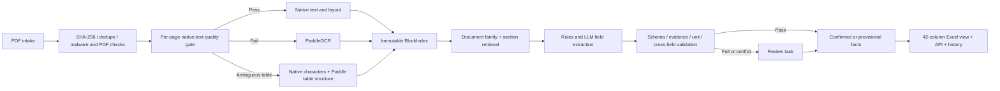

# NPL PDF Field Extraction Workflow Implementation Plan

> **For agentic workers:** REQUIRED: Use superpowers:subagent-driven-development (if subagents available) or superpowers:executing-plans to implement this plan. Steps use checkbox (`- [ ]`) syntax for tracking.

**Goal:** Build an evidence-grounded workflow that extracts the agreed 42 fields from Chinese NPL ABS PDFs, supports human confirmation, and scales from the current sample to 1,000, 10,000, and 1,000,000-document workloads without changing the field or evidence contracts.

**Architecture:** Use DeepSeek Harness as the fixed-version control plane for agent loops, tool policy, session events, human interaction and approval. Keep the document data plane idempotent: hash and register the PDF, assess each page's native text, OCR only failed or ambiguous pages, create an immutable block/cell evidence index, retrieve field-specific candidates, extract normalized facts, validate them deterministically, and publish or route them to review. Python workers own Docling/PaddleOCR and provider-neutral evidence/fact persistence; an external queue owns distributed scheduling. The MVP stores inspectable artifacts on the local filesystem; later tiers replace only execution and storage adapters, not business schemas.

**Tech Stack:** DeepSeek Harness `dsh-v0.1.0-rc.8` pinned to commit `141eb6fef83422698aef7a981029e843e8161534`; Python 3.12 and Pydantic v2 for document workers and business contracts; Docling candidate for native PDF structure; PaddleOCR PP-StructureV3 candidate for Chinese OCR/table structure; provider-neutral model, evidence and fact contracts; JSONL artifacts. FastAPI, PostgreSQL, S3-compatible object storage and a distributed queue are conditional additions only when concurrent-client, multi-host, durability/recovery or soak-test evidence requires them.

---

## 1. Confirmed scope and service objectives

### Confirmed Harness decision

- Use the immutable DeepSeek Harness release `dsh-v0.1.0-rc.8`, commit `141eb6fef83422698aef7a981029e843e8161534`; never build production from a moving branch.
- DeepSeek Harness owns agent/session lifecycle, bounded tool orchestration, human questions, one-shot approvals, permission policy and runtime trace events.
- Python document workers own PDF parsing/OCR, evidence coordinates, deterministic calculations and business schema validation.
- Harness session logs are operational traces, not the sole source of business truth. `Evidence`, `ExtractionFact`, `ReviewDecision` and `WorkflowVersion` remain provider- and Harness-neutral.
- Human feedback is recorded immediately but may only produce candidate workflow changes. Production prompts, skills, rules and field contracts never self-update; promotion requires frozen-gold replay and business data-owner approval.
- DeepSeek Harness upgrades require a separate compatibility test and release decision. The initial release note already documents an incompatible SQLite storage change, so tag drift is treated as a data-migration event.

### Functional scope

- Input: Chinese bank-intermarket NPL ABS issue documents, rating reports, announcements and recurring trustee reports.
- Output: 42-field export plus normalized product, security, report, rating, cash-flow and evidence facts.
- Evidence: every non-null value resolves to the exact document, physical page and table cell or paragraph; models return evidence IDs and cannot invent page coordinates.
- Privacy: native parsing, OCR and retrieval run locally. Only minimum approved text blocks or page crops may leave the controlled environment. A private model can replace cloud adapters without changing schemas.
- Review: MVP results are all human-confirmed. Later tiers automatically confirm only facts that pass frozen quality gates.

### Confirmed service objectives

For every target below, “complete” means machine processing from task acceptance to an evidence-bearing candidate result; it excludes human-review waiting time. Interactive P95 uses the same boundary.

| Workload | Completion objective | Interactive objective |
|---|---:|---:|
| MVP/current sample | Correctness first; no volume SLA | Debuggable stage artifacts |
| 1,000 documents | Within 4 hours | Text PDF P95 ≤ 2 min; OCR-heavy PDF P95 ≤ 5 min |
| 10,000 documents | Within 24 hours | Same per-document P95 under admitted load |
| 1,000,000-document backfill | Within 30 days | Backfill does not starve interactive jobs |
| Steady production increment | 100,000 documents/day | Same per-document P95 under admitted load |

These are benchmark targets, not contractual capacity promises. Production sizing must use pages, OCR pages, candidate blocks and model tokens rather than document count alone.

## 2. End-to-end workflow



### Stage contracts

Each stage is independently retryable and writes a versioned artifact. A retry never silently overwrites a confirmed fact.

| Stage | Deterministic? | Persisted output | Retry key |
|---|---|---|---|
| Intake | Yes | document manifest, hash, source URI | `document_sha256` |
| Page quality | Yes | page diagnostics and route | `document_sha256 + parser_version` |
| Parse/OCR | Mostly | blocks, cells, tables, bbox, confidence | `page_hash + engine_version` |
| Candidate retrieval | Yes for frozen config | candidate evidence IDs per field family | `block_index_version + retriever_version` |
| Model extraction | No | raw response and proposed facts | `request_hash + model_snapshot` |
| Validation | Yes | validation results and failure codes | `fact_set_hash + rule_version` |
| Confirmation | Human/policy | accepted, corrected or rejected facts | immutable decision event |
| Export | Yes | Excel/API projection | `confirmed_fact_version + export_schema_version` |

### Required page-quality diagnostics

Record, do not hide, at least:

```json
{
  "native_char_count": 6236,
  "bad_unicode_ratio": 0.0,
  "useful_char_ratio": 0.98,
  "bbox_valid_ratio": 1.0,
  "duplicate_overlap_ratio": 0.0,
  "image_area_ratio": 0.05,
  "reading_order_status": "pass",
  "domain_token_status": "pass",
  "route": "native"
}
```

Initial hard thresholds are development defaults only. Calibrate them on the current 832-page development set, then freeze all routing rules before a single run on an independent validation set. Validation outcomes may accept or reject a release but may not be used to tune it; once inspected for tuning, that set becomes development data and a fresh unseen holdout is required.

## 3. Parser and model responsibilities

### Parser owns evidence location

```json
{
  "evidence_id": "sha256:p007:t03:r02:c03",
  "document_sha256": "...",
  "document_name": "受托机构报告2026年度第4期总第4期.pdf",
  "physical_page": 7,
  "section": "四、资产池表现情况",
  "table": "（三）资金池现金流流入",
  "row": "处置中",
  "column": "累计回收金额",
  "exact_text": "30,466,642.99",
  "bbox": [356.0, 412.0, 468.0, 438.0]
}
```

### Model owns semantic mapping only

```json
{
  "field_id": "npl_gross_asset_recovery_cash",
  "entity_key": "product:臻粹2026-2",
  "components": [
    {
      "role": "disposal_in_progress_cumulative_recovery",
      "evidence_id": "sha256:p007:t03:r02:c03",
      "exact_quote": "30,466,642.99"
    },
    {
      "role": "disposal_completed_cumulative_recovery",
      "evidence_id": "sha256:p007:t03:r03:c03",
      "exact_quote": "29,941,313.75"
    }
  ]
}
```

The service rejects the proposal if an evidence ID is absent from the current BlockIndex or the exact quote is not present. It hydrates parser-owned location metadata, persists the two component values as separate disclosed facts, and calculates `60,407,956.74 CNY = 0.6040795674 CNY_100M` with a versioned rule that references those fact IDs. The calculated field35 result remains provisional until both inputs are confirmed; a confirmed derived fact may reference only confirmed input facts. The model neither adds the numbers nor supplies page/bbox metadata.

### Use rules where the problem is deterministic

- Codes, dates, currencies, percentages and units: parse and normalize in code.
- Totals and unit conversions: calculate in code and retain disclosed totals separately.
- Date calendars: calculate with a versioned business calendar.
- Cross-field checks: issue totals, tranche balances, recovery sums and date ordering in code.
- LLM use: identify which evidence belongs to which field, resolve synonyms and select among document-specific interpretations.
- Never ask the model to count table rows, add money, invent a page number, or generate a confidence score used as an approval decision.

## 4. Twelve-field vertical slice

Define all 42 contracts first, then implement these 12 fields end-to-end before the remaining 30:

| Field | Why it is representative |
|---|---|
| 1 证券代码 | exact identity and product/tranche association |
| 2 证券全称 | overloaded legacy name and authoritative-source selection |
| 3 债项评级 | array, multiple agencies, scanned rating report |
| 6 初始起算日 | product-level date from a long prospectus |
| 7 到期日期 | expected vs legal date split |
| 12 本级发行总额 | tranche amount and scanned issue-result fallback |
| 14 本级最新余额 | report date vs effective payment date |
| 15 初始未偿本息费 | large monetary scalar and unit discipline |
| 19 首次期间收益支付日 | scheduled, adjusted and actual dates |
| 25 最新报告日期 | recurring-report ordering |
| 35 NPL受托已回收 | multi-row formula and exclusion of other income |
| 39 现金流归集表 | one-to-many table, row order and rounding |

This set exercises native parsing, OCR, tables, arrays, derivation, multi-source precedence, time semantics and evidence grounding. It is not a claim that the other 30 fields are unimportant.

## 5. Four capacity tiers

The current sample has 832 pages across 10 documents and 33 known pure-scan pages. Its average of 83.2 pages/document and 3.97% scan rate is a sizing seed, not a production forecast.

### Capacity equations

```text
total_page_rate = documents × average_pages / completion_seconds
ocr_page_rate   = total_page_rate × ocr_page_share
llm_request_rate = product_bundles × field_family_calls_per_bundle / completion_seconds
candidate_block_rate = candidate_blocks / completion_seconds
model_input_token_rate = model_input_tokens / completion_seconds
model_output_token_rate = model_output_tokens / completion_seconds
worker_count = ceil(required_rate / measured_worker_rate × headroom)
```

Use 2× headroom until arrival patterns and retries are measured. Group fields into approximately 7–12 field-family calls per product bundle; do not make 42 model calls per document.

| Tier | Sample-derived required rate | Minimum architecture | Add only when measured |
|---|---:|---|---|
| MVP | 832 pages total | Local filesystem artifacts; one CLI process; native parser; one PaddleOCR worker; one model adapter; all-human review | Nothing distributed |
| 1,000 / 4h | 5.78 pages/s total; 0.23 OCR pages/s | Local/content-addressed artifacts; bounded process pools; measured OCR GPU worker; bounded model workers | Add API, shared database or object storage only for a named durability/concurrent-host requirement or a failed soak test |
| 10,000 / 24h | 9.63 pages/s total; 0.38 OCR pages/s | Same design horizontally scaled; separate interactive/batch priorities; shared durable storage and queue only when multiple hosts are required | Container autoscaling when fixed replicas fail soak test |
| 1,000,000 / 30d | 32.10 pages/s total; 1.27 OCR pages/s | Stage-specific queues; autoscaled stateless workers; object-store artifacts; partitioned fact/audit tables; backfill throttling | Kafka only if replay plus multiple real-time subscribers is a proven requirement |
| 100,000/day steady | 96.30 pages/s total; 3.82 OCR pages/s | Same million-tier platform sized from benchmark; multi-GPU OCR pool; model quota/PTU or private inference; regional failure plan | Multi-region active-active only after recovery objectives require it |

The rates above use the sample distribution. A scanned 300-page portfolio produces a different plan. Admission control must therefore price jobs by page class after the first-page scan, not by file count.

### Why the 1,000 and 10,000 tiers do not need different core systems

The 10,000-document target over 24 hours is only about 1.67 times the hourly document rate of 1,000 over 4 hours. It generally needs more replicas, not a new architecture. Introduce Kubernetes only when it is already the operating standard or autoscaling/rolling deployment evidence justifies it; do not introduce it to satisfy a document-count label.

### Queue policy

- Use at-least-once delivery plus idempotent stage writes.
- Maintain separate priority for interactive jobs and backfills.
- Bound every worker pool; use queue age, not CPU alone, for autoscaling.
- Retry transient failures with capped exponential backoff and jitter.
- Send permanent PDF, schema and evidence failures to a review/dead-letter state with an explicit reason.
- Do not attempt distributed exactly-once processing.

## 6. Latency budget

Indicative P95 budgets for a typical text PDF:

| Stage | Budget |
|---|---:|
| Intake, hash and PDF checks | 5 s |
| Page quality and native parsing | 30 s |
| Candidate retrieval | 10 s |
| Model extraction | 45 s |
| Validation and projection | 10 s |
| Queue allowance | 20 s |
| Total | 120 s |

For OCR-heavy PDFs, allow up to 180 additional seconds. Measure per-stage latency and queue time separately; otherwise a slow model and an undersized queue look identical.

## 7. Storage and state

### MVP filesystem state machine

```text
runs/{document_sha256}/
├── manifest.json
├── page-quality.jsonl
├── blocks.jsonl
├── tables.jsonl
├── candidates.jsonl
├── model-responses.jsonl
├── facts.jsonl
├── validation.jsonl
└── export.xlsx
```

### Production logical tables

- `documents`: hash, source URI, type, received time and security classification.
- `pages`: diagnostics, parser route and parser/OCR versions.
- `evidence_blocks`: immutable page/block/cell index.
- `extraction_facts`: raw and normalized values, entity, time and status.
- `fact_evidence`: many-to-many evidence links.
- `validation_results`: rule, version, pass/fail and details.
- `review_tasks` and `review_decisions`: immutable analyst workflow.
- `job_stages`: attempt, lease, heartbeat, state and failure code.

Do not use a vector database in the MVP. The corpus per product bundle is small enough for section/token indexes and deterministic lexical retrieval. Add vector retrieval only if the gold set proves recall failures after document-family and heading filters.

## 8. Security and privacy controls

- Store original PDFs and page images only in the approved environment.
- Apply egress allowlists; model adapters receive only selected blocks/cells or necessary page crops.
- Log model provider, snapshot, request hash, evidence IDs and token counts, but do not duplicate full sensitive prompts into broad application logs.
- Encrypt object storage and databases; use short-lived signed object access when images must reach an approved hosted model.
- Keep parser/OCR/model versions on every fact for replay and audit.
- Support a private-model adapter with the same `ExtractionRequest` and `ExtractionFact` schemas.
- Run legal/security review before any external model sees document fragments; public disclosure status alone is not authorization to export all text.

## 9. Gold set, blind model benchmark and quality gates

### Dataset split

- Current 10 PDFs: development set only.
- Label by product bundle, not isolated pages; documents from one product must not be split across development and validation.
- Initial blind validation target: at least 30 unseen product bundles and 300 documents, stratified by document family, page count, scan ratio, template age and difficult tables. Reduce only if the business cannot source enough products, and report the wider statistical uncertainty.
- Run each frozen release candidate on a holdout only once. If the team inspects field-level holdout failures to change routing, prompts, rules or schemas, reclassify that holdout as development data and acquire a fresh product-level holdout for the next release claim.
- Two annotators independently label value, status, entity, time, source document, page, table/paragraph and exact quote. The business data owner adjudicates disagreements.

### Metrics

| Metric | What counts as correct |
|---|---|
| Field-value exact accuracy | normalized value and unit match gold |
| Evidence accuracy | document, page and table/paragraph match gold |
| Entity/time accuracy | correct product/tranche/report and effective date |
| False-fill rate | null/N/A/undisclosed fields are not invented |
| Review rate | fraction requiring analyst decision |
| Parser route accuracy | native/OCR/hybrid matches visual gold |
| P50/P95 latency | end-to-end and per stage |
| Throughput and failure rate | sustained under soak test |
| Cost | parser GPU time and model input/output tokens per document |

Do not use LLM-as-judge for exact money, codes, dates, units or evidence. Use deterministic comparisons; use human adjudication for genuinely ambiguous semantic mappings.

### Provisional release gates

- Schema validity: 100%.
- Critical-field value and evidence accuracy: target ≥ 99.5% on the frozen validation set.
- All-field exact accuracy: target ≥ 97%.
- False-fill rate: target ≤ 0.1% for critical fields.
- No unresolved cross-field contradiction may auto-confirm.
- Text-PDF P95 ≤ 2 minutes and OCR-heavy P95 ≤ 5 minutes at the admitted tier load.
- MVP reviews 100%; production exception review should trend below 5% before million-scale automation is economically credible.

These thresholds are provisional until the business owner approves the critical-field risk policy and the validation set exposes achievable baselines. Never tune on the blind set after seeing model names.

### Model comparison

Use identical candidate evidence, schema, prompt, non-thinking setting and retry budget for Qwen, DeepSeek, Kimi and GLM candidates listed in `docs/research/0001-document-extraction-technology-comparison.md`. Compare quality gates first; among passing models compare P95, throughput and cost. Pin model snapshots during evaluation and record the actual served version in production.

## 10. Implementation file map

The workspace currently has no application repository or test framework. The first implementation should create only the following minimal boundaries:

```text
pyproject.toml                         dependencies and CLI entrypoint
config/fields.v1.yaml                 42 versioned field contracts
src/npl_extract/contracts.py          Pydantic domain/evidence schemas
src/npl_extract/pipeline.py           idempotent stage orchestration
src/npl_extract/parsers.py            native, OCR and hybrid adapters
src/npl_extract/extract.py            retrieval, rules and model adapter
src/npl_extract/validate.py           deterministic validation
src/npl_extract/cli.py                local MVP commands
tests/test_contracts.py               contract and status invariants
tests/test_pipeline.py                one end-to-end document self-check
tests/fixtures/                        small licensed page/text fixtures
```

Add `api.py`, PostgreSQL repositories and distributed workers only after the local vertical slice passes its gold checks and a named operational requirement or soak-test failure justifies them. The current directory is not a Git repository; commit steps below apply only after the project owner initializes or supplies version control.

## 11. Implementation tasks

### Task 0: Bootstrap an offline, safe executable project

**Files:**
- Create: `pyproject.toml`
- Create: `src/npl_extract/__init__.py`
- Create: `src/npl_extract/cli.py`
- Create: `src/npl_extract/intake.py`
- Create: `tests/fixtures/README.md`
- Create: `tests/fixtures/generated-native.pdf`
- Create: `tests/fixtures/generated-scan.pdf`
- Create: `tests/test_intake.py`

- [ ] Define Python 3.12 packaging, CLI entry point, core dependency group and opt-in `parser`, `ocr`, `provider` and `dev` groups with pinned compatible ranges.
- [ ] Pin DeepSeek Harness to `dsh-v0.1.0-rc.8` / `141eb6fef83422698aef7a981029e843e8161534`, record the resolved package/runtime hashes, and fail startup when the runtime identity differs.
- [ ] Add the smallest DeepSeek Harness composition that provides session events, tool registration, `workspace-write + ask` permissions and local-only telemetry; do not enable general shell, recursive subagents or model-written workflows for document extraction.
- [ ] Add one thin bridge from DeepSeek Harness tools to the Python document worker; do not duplicate Docling/PaddleOCR logic in TypeScript.
- [ ] Generate tiny synthetic/licensed fixtures; never copy confidential production pages into the test package.
- [ ] Implement intake checks for PDF magic/type, encrypted or malformed PDFs, configured byte/page/resource limits, safe content-addressed paths and explicit quarantine reasons.
- [ ] Reject or quarantine PDF JavaScript/actions, launch actions, embedded files and other active content; expose an optional approved malware-scanner hook without making unit tests depend on a particular commercial scanner.
- [ ] Run untrusted parser processes with time/memory limits and without network access in the production profile.
- [ ] Add fake parser and fake model adapters so unit and end-to-end tests require no GPU, network or credentials.
- [ ] Run `pytest tests/test_intake.py -q`; expect path traversal, non-PDF, encrypted, active-content, embedded-file and over-limit fixtures to be rejected with stable failure codes.

### Task 1: Freeze the v1 contracts

**Files:**
- Create: `config/fields.v1.yaml`
- Create: `src/npl_extract/contracts.py`
- Create: `tests/test_contracts.py`

- [ ] Encode all 42 contracts with field ID, Chinese export name, entity grain, type, unit, allowed statuses, direct/derived policy, source family and criticality.
- [ ] Encode nested `EvidenceRef`, `ExtractionFact`, `ValidationResult` and `ReviewDecision` Pydantic models.
- [ ] Include `published_at`, `effective_at`, `report_period_end`, source document role/precedence, parser/model/rule versions and derived-fact input IDs; distinguish proposal time from business effective time.
- [ ] Define the field-specific current-value selector as a versioned projection over immutable facts, never as an overwrite operation.
- [ ] Write failing tests that reject a disclosed value without evidence, a derived value without rule inputs, and a tranche field without a security key.
- [ ] Test that a confirmed derived fact cannot reference provisional, rejected or missing input facts.
- [ ] Run `pytest tests/test_contracts.py -q`; expect failures before implementation.
- [ ] Implement the minimum validators and rerun; expect all tests to pass.
- [ ] Record the two pending business definitions for fields 4/5 and 42 as `pending_definition`, not invented enums.

### Task 2: Build the local page pipeline

**Files:**
- Create: `src/npl_extract/parsers.py`
- Create: `src/npl_extract/pipeline.py`
- Create: `tests/test_pipeline.py`

- [ ] Define a parser adapter returning blocks/cells with page and bbox provenance.
- [ ] Implement thin opt-in Docling native and PaddleOCR OCR/table adapters behind the same contract; when an optional dependency/model is absent, return a clear `PARSER_EXTRA_MISSING` or `OCR_EXTRA_MISSING` setup error rather than silently falling back.
- [ ] Implement page diagnostics and native/OCR/hybrid routing.
- [ ] Persist `manifest.json`, `page-quality.jsonl`, `blocks.jsonl` and `tables.jsonl` under a content hash.
- [ ] Prove idempotency by running the same fixture twice and asserting the second run reuses identical stage artifacts.
- [ ] Test the three known page classes: normal native page, scan-only page and complex native table page.
- [ ] Keep real Docling/PaddleOCR checks opt-in; `pytest -q` must pass with offline fake adapters.

### Task 3: Implement evidence-first extraction for 12 fields

**Files:**
- Create: `src/npl_extract/extract.py`
- Modify: `src/npl_extract/pipeline.py`
- Modify: `tests/test_pipeline.py`

- [ ] Implement document-family and heading filters before any model call.
- [ ] Build candidate bundles with evidence IDs and exact text.
- [ ] Register the bounded document tools (`retrieve_evidence`, `get_page`, `get_table`, `extract_field_facts`, `validate_facts`, `request_review`) in the pinned DeepSeek Harness composition; keep their payloads provider- and Harness-neutral.
- [ ] Configure one provisional model route through DeepSeek Harness while preserving a provider-neutral model request/response contract.
- [ ] Enforce per-run limits for agent steps, extra evidence pages, model tokens, tool timeouts and retries; exhaustion produces an explicit review reason rather than an autonomous continuation.
- [ ] Deny hosted-model egress by default. Before a hosted call, require approved data classification, destination allowlist, minimum-fragment/page-crop enforcement and audit metadata containing request hash, evidence IDs, provider and model snapshot.
- [ ] Implement deterministic code/date/money/unit normalization.
- [ ] Extract the 12 vertical-slice fields and persist raw responses plus facts.
- [ ] Assert every returned evidence ID belongs to the input bundle and every exact quote exists.
- [ ] Have the model select and label field35 component evidence only; persist two disclosed component facts, calculate the provisional sum and unit conversion in a versioned server-side rule, and assert that the other-income row is excluded and confirmation waits for confirmed inputs.

### Task 4: Add validation, review artifacts and Excel projection

**Files:**
- Create: `src/npl_extract/validate.py`
- Modify: `src/npl_extract/cli.py`
- Modify: `tests/test_pipeline.py`

- [ ] Implement issue-amount sums, balance effective-date checks, date ordering, rating multiplicity, recovery sums and rounding-aware cash-flow checks.
- [ ] Emit explicit failures such as `EVIDENCE_NOT_FOUND`, `UNIT_MISMATCH`, `SOURCE_CONFLICT`, `NOT_APPLICABLE_FALSE_FILL` and `CROSS_FIELD_MISMATCH`.
- [ ] Write a review JSON artifact containing proposed value and exact evidence context.
- [ ] Connect DeepSeek Harness structured user questions/approval to `accept`, `correct` and `reject` operations that append immutable `ReviewDecision` events and never overwrite confirmed facts; keep a CLI caller only as a thin operational client of the same domain operation.
- [ ] Persist structured feedback reason codes separately from the Harness transcript and set workflow refinement to `propose_only`; no feedback path may mutate the active production version.
- [ ] Implement source- and time-specific current-value projections, including report date versus period end versus payment-effective balance date.
- [ ] Export the legacy 42-column Excel view without flattening away normalized history.
- [ ] Run the current 10-PDF development set and have a human verify every vertical-slice fact.

### Task 5: Build the gold-set harness and blind model comparison

**Files:**
- Create: `evaluation/gold.schema.json`
- Create: `evaluation/run_eval.py`
- Create: `evaluation/report.py`
- Create: `tests/test_evaluation.py`

- [ ] Define gold records for value, status, entity, time and evidence.
- [ ] Enforce product-level split isolation.
- [ ] Calculate exact field, evidence, false-fill, review, latency and cost metrics deterministically.
- [ ] Run the same frozen requests against the four approved candidate model families.
- [ ] Implement or configure the remaining thin Qwen, DeepSeek, Kimi and GLM adapters through the provider-neutral contract; gate each live integration on explicit credentials and mark absent-credential checks as skipped, never failed.
- [ ] Keep fake-adapter contract tests mandatory so `pytest -q` remains offline and credential-free.
- [ ] Reject any model failing critical-field gates before comparing cost.
- [ ] Save raw per-field failures so the benchmark remains auditable.

### Task 6: Extend from 12 to all 42 fields

**Files:**
- Modify: `config/fields.v1.yaml`
- Modify: `src/npl_extract/extract.py`
- Modify: `src/npl_extract/validate.py`
- Modify: relevant tests

- [ ] Add remaining fields by the seven field families, one family at a time.
- [ ] Keep multi-valued ratings/institutions as child facts and cash flow as child rows.
- [ ] Preserve `not_applicable`, `not_disclosed`, `derived`, `ambiguous` and `pending_definition` distinctly.
- [ ] Run the full development set after each field family. Run a fresh unseen holdout once per frozen release candidate; never reuse exposed holdout failures for tuning while still calling the set blind.
- [ ] After a frozen release passes approved gates, implement a versioned auto-confirm policy that requires schema, evidence, deterministic and cross-field validation success and appends an immutable system `ReviewDecision`; test that any failed or missing gate leaves the fact provisional.

### Task 7: Prove the 1,000-document tier; add an async service only if required

**Files:**
- Create: `tests/load/run_local.py`
- Conditional create, only if remote concurrent submission is required: `src/npl_extract/api.py`
- Conditional create, only if shared job coordination is required: `src/npl_extract/jobs.py`
- Conditional create, only after PostgreSQL is justified and its schema approved: `migrations/`
- Conditional create with the corresponding service: `tests/test_jobs.py`

- [ ] First prove the local artifact runner and bounded process pools can complete the representative 1,000-document load in four hours.
- [ ] Implement `tests/load/run_local.py` to generate/replay the approved page/OCR/token distribution and report machine-result completion, per-stage queue age and text/OCR P95 without an API or database.
- [ ] Add an async API only if concurrent clients need remote submission; implement idempotent submission by document hash and client request key.
- [ ] Add status, result and review endpoints only with that API; processing remains asynchronous.
- [ ] Add shared object storage and PostgreSQL only if multiple hosts, durability/recovery requirements or the soak test require them; if PostgreSQL is adopted, use bounded `FOR UPDATE SKIP LOCKED` leases before adding a separate broker.
- [ ] Separate interactive and batch priorities.
- [ ] Assert 1,000 sample-distribution documents reach evidence-bearing candidate output within four hours with 2× headroom, while admitted text/OCR interactive jobs reach the same machine-result boundary at P95 ≤2/5 minutes; exclude human-review wait from both measurements.
- [ ] Add workers only at the stage whose queue-age budget fails.

### Task 8: Prove the 10,000-document tier

**Files:**
- Modify deployment manifests selected by the operating environment
- Modify load-test scenarios

- [ ] Run a 24-hour soak test with representative long PDFs, OCR ratios, candidate-block/token distributions, model failures and retries.
- [ ] Assert 10,000 documents reach evidence-bearing candidate output within 24 hours and admitted text/OCR jobs reach the same machine-result boundary at P95 ≤2/5 minutes while batch and interactive traffic run together; exclude human-review wait.
- [ ] Verify no duplicate confirmed facts after worker termination and redelivery.
- [ ] Verify backpressure protects interactive P95.
- [ ] Adopt a managed queue or container autoscaling only if PostgreSQL queue age or fixed replicas fail the test.

### Task 9: Prove the million-document backfill and 100,000/day steady tier

**Files:**
- Modify production deployment and partitioning configuration after measured bottlenecks are known
- Modify disaster-recovery and security runbooks

- [ ] Replay production-like page, candidate-block and token distributions through stage-specific queues.
- [ ] Size CPU, GPU and model quota independently with the capacity equations.
- [ ] Partition high-volume audit/fact tables and keep immutable artifacts in object storage.
- [ ] Throttle backfill whenever interactive queue age approaches its budget.
- [ ] Demonstrate recovery from worker, queue, database and model-provider interruption.
- [ ] Assert 1,000,000 backfill documents reach evidence-bearing candidate output within 30 days and the same platform sustains 100,000 such machine results/day, while admitted text/OCR jobs reach the same boundary at P95 ≤2/5 minutes and backfill throttling protects interactive traffic; exclude human-review wait.
- [ ] Reconfirm security approval for egress and test the private-model adapter before regulated deployment; hosted egress must already have been deny-by-default since Task 3.

## 12. Stop/go checkpoints

1. Do not automate all 42 fields until the 12-field slice can be reproduced with exact evidence.
2. Do not lock a model vendor until the independent product-level gold set is frozen and blind-tested.
3. Do not add a vector database, Kafka or Kubernetes because of anticipated scale; add each only after a named metric fails.
4. Do not promise 1,000/10,000/1,000,000 capacity until page, OCR and token distributions pass the relevant soak test.
5. Do not auto-confirm critical facts until field, evidence and false-fill gates pass on unseen products.

## 13. Existing supporting documents

- `docs/research/0001-document-extraction-technology-comparison.md`: parser/OCR/model comparison and primary sources.
- `docs/research/0002-financial-field-definitions-and-decisions.md`: financial definitions, sample values and accepted Q43–Q47 decisions.
- `docs/adr/0001-normalized-facts-with-parser-owned-evidence.md`: normalized facts and parser-owned evidence decision.
- `CONTEXT.md`: domain glossary.
