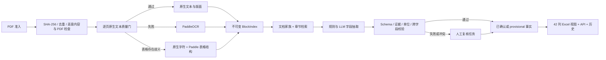

# NPL PDF 字段抽取工作流实施计划

> **面向 Agent 执行者：** 必须使用 `superpowers:subagent-driven-development`（若可使用 subagent）或 `superpowers:executing-plans` 来实施本计划。各步骤使用复选框（`- [ ]`）语法跟踪进度。

**目标：** 构建一个以证据为基础的工作流，从中国 NPL ABS PDF 中抽取已约定的 42 个字段，支持人工确认，并且在不修改字段契约或证据契约的前提下，从当前样例扩展到 1,000、10,000 和 1,000,000 份文档的工作负载。

**架构：** 使用固定版本的 DeepSeek Harness 作为 Agent loop、工具策略、Session 事件、人工交互和审批的控制平面。文档数据平面保持幂等：对 PDF 计算哈希并登记；评估每一页的原生文本质量；只对失败或存在歧义的页面执行 OCR；建立不可变的 block/cell 证据索引；检索字段特定候选证据；抽取标准化事实；用确定性规则校验；最后发布结果或路由到人工复核。Python worker 负责 Docling/PaddleOCR，以及与模型供应商无关的证据/事实持久化；外部队列负责分布式调度。MVP 阶段将可检查的工件保存在本地文件系统；后续扩容阶段只替换执行和存储适配器，不修改业务 schema。

**技术栈：** DeepSeek Harness `dsh-v0.1.0-rc.8`，固定到 commit `141eb6fef83422698aef7a981029e843e8161534`；文档 worker 和业务契约使用 Python 3.12 + Pydantic v2；原生 PDF 结构解析候选为 Docling；中文 OCR/表格结构候选为 PaddleOCR PP-StructureV3；模型、证据和事实契约均与供应商无关；工件采用 JSONL。FastAPI、PostgreSQL、S3 兼容对象存储和分布式队列仅在并发客户端、多主机、持久性/恢复要求或 soak test 证据表明确有需要时再加入。

---

## 1. 已确认的范围与服务目标

### 已确认的 Harness 决策

- 使用不可变的 DeepSeek Harness release `dsh-v0.1.0-rc.8`，commit `141eb6fef83422698aef7a981029e843e8161534`；生产环境绝不基于持续变化的 branch 构建。
- DeepSeek Harness 负责 Agent/Session 生命周期、受限工具编排、向人提问、一次性审批、权限策略和运行时 trace 事件。
- Python 文档 worker 负责 PDF 解析/OCR、证据坐标、确定性计算和业务 schema 校验。
- Harness Session 日志属于运行操作 trace，不是业务真相的唯一来源。`Evidence`、`ExtractionFact`、`ReviewDecision` 和 `WorkflowVersion` 必须保持与模型供应商及 Harness 无关。
- 人工反馈应立即记录，但只能产生候选工作流变更。生产 Prompt、Skill、规则和字段契约不能自我更新；任何变更晋级都必须通过冻结金标 replay，并获得业务数据负责人的批准。
- DeepSeek Harness 升级必须经过独立兼容性测试和 release 决策。初始 release note 已经记录过不兼容的 SQLite 存储变更，因此 tag 漂移应被视为一次数据迁移事件。

### 功能范围

- 输入：中国银行间市场 NPL ABS 的发行文档、评级报告、公告及周期性受托机构报告。
- 输出：42 字段导出，以及标准化的产品、证券、报告、评级、现金流和证据事实。
- 证据：每一个非空值必须能定位到精确的文档、物理页以及表格单元格或段落；模型只返回 evidence ID，不能自行编造页码或坐标。
- 隐私：原生解析、OCR 和检索全部在本地运行。只有经过批准的最小文本 block 或必要页面 crop 可以离开受控环境。私有模型可以在不改变 schema 的情况下替换云端 adapter。
- 复核：MVP 的所有结果都必须由人工确认。后续阶段只允许自动确认通过冻结质量门槛的事实。

### 已确认的服务目标

以下每一个目标中，“完成”指从任务被接受开始，到机器产生带证据的候选结果为止；不包含等待人工复核的时间。交互式 P95 也使用同一时间边界。

| 工作负载 | 完成目标 | 交互目标 |
|---|---:|---:|
| MVP / 当前样例 | 正确性优先；不设吞吐 SLA | 各阶段工件可调试 |
| 1,000 份文档 | 4 小时内 | 文本 PDF P95 ≤ 2 分钟；OCR-heavy PDF P95 ≤ 5 分钟 |
| 10,000 份文档 | 24 小时内 | 准入负载下维持相同单文档 P95 |
| 1,000,000 份历史回填 | 30 天内 | Backfill 不得挤占交互任务资源 |
| 稳态生产增量 | 100,000 份文档/天 | 准入负载下维持相同单文档 P95 |

以上是 benchmark 目标，不是合同式容量承诺。生产 sizing 必须基于页数、OCR 页数、候选 block 数量和模型 token 数，而不是只按文档数量估算。

## 2. 端到端工作流



### 阶段契约

每一个阶段都可以独立重试，并写出带版本的工件。重试绝不能静默覆盖已经确认的事实。

| 阶段 | 是否确定性 | 持久化输出 | 重试键 |
|---|---|---|---|
| Intake | 是 | 文档 manifest、hash、source URI | `document_sha256` |
| 页面质量 | 是 | 页面诊断信息和 route | `document_sha256 + parser_version` |
| Parse/OCR | 大部分 | blocks、cells、tables、bbox、confidence | `page_hash + engine_version` |
| 候选检索 | 冻结配置下为是 | 每个字段家族的候选 evidence ID | `block_index_version + retriever_version` |
| 模型抽取 | 否 | 原始响应和候选事实 | `request_hash + model_snapshot` |
| 校验 | 是 | 校验结果和失败码 | `fact_set_hash + rule_version` |
| 确认 | 人工/策略 | 接受、更正或拒绝的事实 | 不可变 decision event |
| 导出 | 是 | Excel/API projection | `confirmed_fact_version + export_schema_version` |

### 必须记录的页面质量诊断

至少记录以下内容，不能隐藏：

```json
{
  "native_char_count": 6236,
  "bad_unicode_ratio": 0.0,
  "useful_char_ratio": 0.98,
  "bbox_valid_ratio": 1.0,
  "duplicate_overlap_ratio": 0.0,
  "image_area_ratio": 0.05,
  "reading_order_status": "pass",
  "domain_token_status": "pass",
  "route": "native"
}
```

初始硬阈值只能作为开发阶段默认值。应先在当前 832 页开发集上校准，再在任何独立验证集运行之前冻结全部路由规则。验证结果只能决定某个 release 是否接受或拒绝，不能再用于调参；一旦为了调优而查看该验证集，它就必须被重新归类为开发数据，下一个 release claim 必须使用新的未见 holdout。

## 3. Parser 与模型的职责边界

### Parser 负责证据位置

```json
{
  "evidence_id": "sha256:p007:t03:r02:c03",
  "document_sha256": "...",
  "document_name": "受托机构报告2026年度第4期总第4期.pdf",
  "physical_page": 7,
  "section": "四、资产池表现情况",
  "table": "（三）资金池现金流流入",
  "row": "处置中",
  "column": "累计回收金额",
  "exact_text": "30,466,642.99",
  "bbox": [356.0, 412.0, 468.0, 438.0]
}
```

### 模型只负责语义映射

```json
{
  "field_id": "npl_gross_asset_recovery_cash",
  "entity_key": "product:臻粹2026-2",
  "components": [
    {
      "role": "disposal_in_progress_cumulative_recovery",
      "evidence_id": "sha256:p007:t03:r02:c03",
      "exact_quote": "30,466,642.99"
    },
    {
      "role": "disposal_completed_cumulative_recovery",
      "evidence_id": "sha256:p007:t03:r03:c03",
      "exact_quote": "29,941,313.75"
    }
  ]
}
```

如果 evidence ID 不存在于当前 BlockIndex 中，或 exact quote 并不存在于对应证据中，服务应拒绝该 proposal。服务随后补全 parser 持有的位置元数据，将两个 component value 分别持久化为独立的 disclosed facts，并使用引用这些 fact ID 的版本化规则计算 `60,407,956.74 CNY = 0.6040795674 CNY_100M`。字段 35 的计算结果在两个输入均被确认前必须保持 provisional；已确认的派生事实只能引用已经确认的输入事实。模型既不负责做加法，也不负责提供页码/bbox 元数据。

### 对确定性问题使用规则

- 代码、日期、币种、百分比和单位：在代码中解析和标准化。
- 总数和单位转换：在代码中计算，同时单独保留原文披露的 total。
- 日期日历：使用版本化业务日历计算。
- 跨字段检查：发行总额、分档余额、回收总和和日期顺序在代码中检查。
- LLM 的用途：判断哪条证据属于哪个字段、消解同义表达、在文档特定解释之间进行选择。
- 不要让模型数表格行、做金额加法、编造页码，或生成一个被用于审批决策的“置信度分数”。

## 4. 12 字段纵向切片

先定义全部 42 个字段契约，再优先把下面 12 个字段端到端实现，之后再扩展剩余 30 个字段：

| 字段 | 为什么具有代表性 |
|---|---|
| 1 证券代码 | 精确身份识别，以及产品/分档关联 |
| 2 证券全称 | 旧字段名语义过载和权威来源选择 |
| 3 债项评级 | 数组、多评级机构、扫描版评级报告 |
| 6 初始起算日 | 从长篇发行说明书中提取产品级日期 |
| 7 到期日期 | 预计到期日与法定到期日拆分 |
| 12 本级发行总额 | 分档金额，以及扫描版发行结果 fallback |
| 14 本级最新余额 | 报告日期与支付后生效日期的区别 |
| 15 初始未偿本息费 | 大额金额标量和严格单位处理 |
| 19 首次期间收益支付日 | 计划、调整后和实际日期 |
| 25 最新报告日期 | 周期性报告排序 |
| 35 NPL受托已回收 | 多行公式，并排除其他收入 |
| 39 现金流归集表 | 一对多表格、行顺序和舍入 |

这一组字段能够覆盖原生解析、OCR、表格、数组、派生计算、多来源优先级、时间语义和证据 grounding。它并不意味着剩余 30 个字段不重要。

## 5. 四个容量层级

当前样例包含 10 份文档、共 832 页，其中已知纯扫描页 33 页。平均 83.2 页/文档、扫描页比例 3.97%，只能作为 sizing 的初始种子，不能当成生产分布预测。

### 容量计算公式

```text
total_page_rate = documents × average_pages / completion_seconds
ocr_page_rate   = total_page_rate × ocr_page_share
llm_request_rate = product_bundles × field_family_calls_per_bundle / completion_seconds
candidate_block_rate = candidate_blocks / completion_seconds
model_input_token_rate = model_input_tokens / completion_seconds
model_output_token_rate = model_output_tokens / completion_seconds
worker_count = ceil(required_rate / measured_worker_rate × headroom)
```

在到达模式和重试分布被真实测量前，使用 2× headroom。每个产品 bundle 约聚合为 7–12 个字段家族调用；不要对每一份文档做 42 次模型调用。

| 层级 | 基于样例推导的所需速率 | 最小架构 | 仅在测量证明需要时增加 |
|---|---:|---|---|
| MVP | 总计 832 页 | 本地文件系统工件；一个 CLI 进程；原生 parser；一个 PaddleOCR worker；一个 model adapter；全部人工复核 | 不需要任何分布式组件 |
| 1,000 / 4h | 总 5.78 页/s；OCR 0.23 页/s | 本地/内容寻址工件；受限进程池；经过实测的 OCR GPU worker；受限模型 worker | 仅当存在明确 durability/并发多主机要求或 soak test 失败时增加 API、共享数据库或对象存储 |
| 10,000 / 24h | 总 9.63 页/s；OCR 0.38 页/s | 同一设计水平扩容；交互/批处理分优先级；只有多主机时才使用共享持久存储和队列 | 固定 replica 不能通过 soak test 时再加容器自动扩容 |
| 1,000,000 / 30d | 总 32.10 页/s；OCR 1.27 页/s | 分阶段队列；自动扩缩的无状态 worker；对象存储工件；分区 fact/audit 表；backfill 限流 | 只有当 replay + 多个实时 subscriber 被证明是明确需求时才用 Kafka |
| 稳态 100,000/day | 总 96.30 页/s；OCR 3.82 页/s | 同一百万级平台按 benchmark sizing；多 GPU OCR pool；模型 quota/PTU 或私有推理；区域故障计划 | 只有恢复目标要求时才上多地域 active-active |

以上速率使用当前样例分布。一个 300 页的扫描型资产池会产生完全不同的容量计划。因此准入控制应在首轮页面扫描后按页面类别给任务“计价”，而不是仅按文件数量。

### 为什么 1,000 和 10,000 两级不需要不同的核心系统

10,000 份/24 小时对应的每小时文档速率，仅约为 1,000 份/4 小时的 1.67 倍。通常需要的是更多 replica，而不是换一套架构。只有 Kubernetes 已经是组织运行标准，或者自动扩容/滚动部署的证据确实证明必要时才引入；不能为了满足某个“文档数量标签”而引入 Kubernetes。

### 队列策略

- 使用 at-least-once delivery + 幂等阶段写入。
- 交互任务和 backfill 任务保持独立优先级。
- 所有 worker pool 都必须有界；自动扩容看 queue age，而不是只看 CPU。
- 瞬时失败使用有上限的指数退避 + jitter 重试。
- 永久性的 PDF、schema 和 evidence 失败进入带明确原因的 review/dead-letter 状态。
- 不尝试实现分布式 exactly-once processing。

## 6. 延迟预算

典型文本 PDF 的建议 P95 预算：

| 阶段 | 预算 |
|---|---:|
| Intake、hash 和 PDF 检查 | 5 s |
| 页面质量与原生解析 | 30 s |
| 候选检索 | 10 s |
| 模型抽取 | 45 s |
| 校验和 projection | 10 s |
| Queue allowance | 20 s |
| 总计 | 120 s |

对于 OCR-heavy PDF，额外允许最多 180 秒。必须分别测量每个阶段的 latency 和 queue time；否则“模型本身很慢”和“队列容量不足”会表现成同一个问题。

## 7. 存储与状态

### MVP 文件系统状态机

```text
runs/{document_sha256}/
├── manifest.json
├── page-quality.jsonl
├── blocks.jsonl
├── tables.jsonl
├── candidates.jsonl
├── model-responses.jsonl
├── facts.jsonl
├── validation.jsonl
└── export.xlsx
```

### 生产环境逻辑表

- `documents`：hash、source URI、类型、接收时间和安全分类。
- `pages`：诊断信息、parser route、parser/OCR version。
- `evidence_blocks`：不可变的 page/block/cell 索引。
- `extraction_facts`：原始值和标准化值、entity、time、status。
- `fact_evidence`：fact 与 evidence 的多对多关联。
- `validation_results`：rule、version、pass/fail 和 details。
- `review_tasks` 与 `review_decisions`：不可变的分析人员工作流。
- `job_stages`：attempt、lease、heartbeat、state 和 failure code。

MVP 不使用向量数据库。每个产品 bundle 的语料规模足够小，可以通过 section/token index + 确定性 lexical retrieval 处理。只有当金标集证明在 document-family 和 heading filter 之后仍存在召回缺失时，才增加向量检索。

## 8. 安全与隐私控制

- 原始 PDF 和页面图像只能保存在批准的环境内。
- 应用 egress allowlist；模型 adapter 只能收到选定的 blocks/cells 或必要 page crops。
- 记录模型 provider、snapshot、request hash、evidence IDs 和 token counts，但不要把完整敏感 prompt 复制到广泛可见的应用日志中。
- 对象存储和数据库必须加密；当图像确实需要发送到批准的 hosted model 时，使用短生命周期签名对象访问。
- 每一条 fact 都记录 parser/OCR/model version，便于 replay 和审计。
- 使用相同的 `ExtractionRequest` 和 `ExtractionFact` schema 支持 private-model adapter。
- 在任何外部模型看到文档 fragment 前都必须完成法务/安全审查；“文档已经公开披露”本身不等于有权将全部文本发送出受控环境。

## 9. 金标集、盲测模型 benchmark 与质量门槛

### 数据集拆分

- 当前 10 份 PDF：只能作为 development set。
- 按 product bundle 标注和拆分，不能按孤立页面拆分；同一产品的文档不能同时出现在 development 和 validation 中。
- 初始 blind validation 目标：至少 30 个未见 product bundle、300 份文档，并按 document family、页数、扫描比例、模板年代和困难表格分层。如果业务无法提供足够产品，才可以缩小规模，同时必须报告因此带来的更宽统计不确定性。
- 每个冻结 release candidate 对 holdout 只运行一次。如果团队查看字段级 holdout 失败并据此修改 route、prompt、rule 或 schema，则该 holdout 必须重新归为 development data；下一次 release claim 必须重新获取全新的 product-level holdout。
- 两名标注人员独立标注 value、status、entity、time、source document、page、table/paragraph 和 exact quote；分歧由业务数据负责人裁决。

### 指标

| 指标 | 什么算正确 |
|---|---|
| 字段值 exact accuracy | 标准化值和单位与金标一致 |
| Evidence accuracy | 文档、页码和表格/段落与金标一致 |
| Entity/time accuracy | product/tranche/report 和 effective date 正确 |
| False-fill rate | 对 null/N/A/未披露字段不凭空填值 |
| Review rate | 需要分析人员决策的比例 |
| Parser route accuracy | native/OCR/hybrid 与人工视觉金标一致 |
| P50/P95 latency | 端到端以及逐阶段 latency |
| Throughput 和 failure rate | soak test 下可持续 |
| Cost | 每份文档的 parser GPU 时间和模型 input/output token |

对于精确金额、代码、日期、单位和证据，不使用 LLM-as-judge。使用确定性比较；只有真正存在语义歧义的 mapping 才由人工裁决。

### 暂定 release gates

- Schema validity：100%。
- 关键字段 value + evidence accuracy：冻结 validation set 上目标 ≥ 99.5%。
- 全字段 exact accuracy：目标 ≥ 97%。
- 关键字段 false-fill rate：目标 ≤ 0.1%。
- 存在未解决的跨字段矛盾时，不得自动确认。
- 在相应准入负载下，文本 PDF P95 ≤ 2 分钟，OCR-heavy P95 ≤ 5 分钟。
- MVP 100% 人工复核；在百万级自动化具备经济可行性之前，生产 exception review 应逐步下降到 5% 以下。

这些阈值在业务负责人批准关键字段风险策略、并且 validation set 暴露可实现基线之前都只是暂定值。看到模型名称或 blind set 结果之后，绝不能继续在 blind set 上调优。

### 模型比较

对 `docs/research/0001-document-extraction-technology-comparison.md` 中列出的 Qwen、DeepSeek、Kimi 和 GLM 候选模型，必须使用完全相同的候选证据、schema、prompt、non-thinking 设置和 retry budget。先比较是否通过质量门槛；对通过门槛的模型再比较 P95、throughput 和 cost。评估期间固定 model snapshot，并在生产中记录实际服务版本。

## 10. 实现文件结构

当前 workspace 还没有应用仓库或测试框架。第一次实现只应建立以下最小边界：

```text
pyproject.toml                         依赖与 CLI entrypoint
config/fields.v1.yaml                 42 个版本化字段契约
src/npl_extract/contracts.py          Pydantic 领域/证据 schema
src/npl_extract/pipeline.py           幂等阶段编排
src/npl_extract/parsers.py            native、OCR 和 hybrid adapter
src/npl_extract/extract.py            检索、规则和 model adapter
src/npl_extract/validate.py           确定性校验
src/npl_extract/cli.py                本地 MVP 命令
tests/test_contracts.py               契约和状态不变量测试
tests/test_pipeline.py                一个端到端文档自检
tests/fixtures/                        小型、有授权的页面/文本 fixture
```

只有当本地 vertical slice 通过金标检查，并且存在明确运营需求或 soak-test 失败证明有必要时，才增加 `api.py`、PostgreSQL repository 和分布式 worker。当前目录还不是 Git repository；下面涉及 commit 的步骤只在项目 owner 初始化或提供版本控制后适用。

## 11. 实现任务

### Task 0：搭建离线、安全、可执行的项目骨架

**文件：**
- 新建：`pyproject.toml`
- 新建：`src/npl_extract/__init__.py`
- 新建：`src/npl_extract/cli.py`
- 新建：`src/npl_extract/intake.py`
- 新建：`tests/fixtures/README.md`
- 新建：`tests/fixtures/generated-native.pdf`
- 新建：`tests/fixtures/generated-scan.pdf`
- 新建：`tests/test_intake.py`

- [ ] 定义 Python 3.12 packaging、CLI entry point、核心依赖组，以及可选的 `parser`、`ocr`、`provider` 和 `dev` 依赖组，并固定兼容版本范围。
- [ ] 将 DeepSeek Harness 固定到 `dsh-v0.1.0-rc.8` / `141eb6fef83422698aef7a981029e843e8161534`，记录解析后的 package/runtime hash；如果运行时身份不一致则启动失败。
- [ ] 增加最小 DeepSeek Harness composition，只提供 session events、tool registration、`workspace-write + ask` 权限和仅本地 telemetry；文档抽取场景不要开启通用 shell、递归 subagent 或由模型编写 workflow 的能力。
- [ ] 增加一个从 DeepSeek Harness tool 到 Python document worker 的薄桥接层；不要在 TypeScript 中重复实现 Docling/PaddleOCR 逻辑。
- [ ] 生成极小的合成/已授权 fixtures；不要将保密生产页面复制进测试包。
- [ ] 实现 PDF intake 检查：PDF magic/type、加密或损坏 PDF、配置的字节/页数/资源限制、安全的 content-addressed path，以及明确的 quarantine 原因。
- [ ] 拒绝或隔离 PDF JavaScript/actions、launch actions、embedded files 及其他 active content；提供可选的、经过批准的 malware-scanner hook，但单元测试不能依赖某个商业扫描器。
- [ ] 在生产 profile 中，以时间/内存限制并禁用网络的方式运行不可信 parser 进程。
- [ ] 增加 fake parser 和 fake model adapter，使 unit test 和端到端测试都不需要 GPU、网络或 credential。
- [ ] 运行 `pytest tests/test_intake.py -q`；预期 path traversal、非 PDF、加密、active-content、embedded-file 和超限 fixture 都会以稳定 failure code 被拒绝。

### Task 1：冻结 v1 契约

**文件：**
- 新建：`config/fields.v1.yaml`
- 新建：`src/npl_extract/contracts.py`
- 新建：`tests/test_contracts.py`

- [ ] 为全部 42 个字段编码契约，包括 field ID、中文导出名、entity grain、type、unit、允许状态、direct/derived policy、source family 和 criticality。
- [ ] 编码嵌套的 `EvidenceRef`、`ExtractionFact`、`ValidationResult` 和 `ReviewDecision` Pydantic model。
- [ ] 包含 `published_at`、`effective_at`、`report_period_end`、source document role/precedence、parser/model/rule version 和派生事实 input IDs；区分 proposal time 与业务 effective time。
- [ ] 将字段特定的 current-value selector 定义为对不可变 facts 的版本化 projection，而不是 overwrite 操作。
- [ ] 先写失败测试，确保以下情况会被拒绝：disclosed value 没有 evidence；derived value 没有 rule inputs；tranche 字段没有 security key。
- [ ] 测试已确认的派生 fact 不能引用 provisional、rejected 或 missing 的输入 fact。
- [ ] 运行 `pytest tests/test_contracts.py -q`；实现前应预期失败。
- [ ] 实现最小 validators 后重跑；预期全部通过。
- [ ] 将字段 4/5 和 42 仍待业务定义的内容记录为 `pending_definition`，不要自行编造 enum。

### Task 2：构建本地页面处理 pipeline

**文件：**
- 新建：`src/npl_extract/parsers.py`
- 新建：`src/npl_extract/pipeline.py`
- 新建：`tests/test_pipeline.py`

- [ ] 定义 parser adapter，输出带 page 和 bbox provenance 的 blocks/cells。
- [ ] 在同一契约后面实现薄的可选 Docling native adapter 和 PaddleOCR OCR/table adapter；如果缺少可选依赖/模型，明确返回 `PARSER_EXTRA_MISSING` 或 `OCR_EXTRA_MISSING`，而不是静默 fallback。
- [ ] 实现页面 diagnostics 以及 native/OCR/hybrid routing。
- [ ] 在 content hash 下持久化 `manifest.json`、`page-quality.jsonl`、`blocks.jsonl` 和 `tables.jsonl`。
- [ ] 对同一个 fixture 连续运行两次，证明幂等性：第二次应复用完全相同的阶段工件。
- [ ] 测试三种已知页面类型：正常 native page、scan-only page、复杂 native table page。
- [ ] 真实 Docling/PaddleOCR 检查保持 opt-in；`pytest -q` 在仅使用 offline fake adapter 时也必须通过。

### Task 3：为 12 个字段实现 evidence-first 抽取

**文件：**
- 新建：`src/npl_extract/extract.py`
- 修改：`src/npl_extract/pipeline.py`
- 修改：`tests/test_pipeline.py`

- [ ] 在任何 model call 之前先实现 document-family 和 heading filter。
- [ ] 构造带 evidence ID 与 exact text 的 candidate bundle。
- [ ] 在固定版本的 DeepSeek Harness composition 中注册有界文档工具：`retrieve_evidence`、`get_page`、`get_table`、`extract_field_facts`、`validate_facts`、`request_review`；payload 保持与 provider 和 Harness 无关。
- [ ] 通过 DeepSeek Harness 配置一条 provisional model route，同时保留 provider-neutral model request/response contract。
- [ ] 对每次 run 限制 agent steps、额外证据页数、model tokens、tool timeout 和 retries；一旦额度耗尽，必须生成明确 review reason，而不是继续自主循环。
- [ ] hosted-model egress 默认拒绝。任何 hosted call 之前，都必须要求：已批准的数据分类、destination allowlist、最小 fragment/page-crop 约束，以及包含 request hash、evidence IDs、provider 和 model snapshot 的审计元数据。
- [ ] 用确定性代码实现 code/date/money/unit normalization。
- [ ] 抽取 12 个 vertical-slice 字段，并持久化 raw response 和 facts。
- [ ] 断言所有模型返回的 evidence ID 都属于当前输入 bundle，且每个 exact quote 确实存在。
- [ ] 对 field35，只让模型选择并标记 component evidence；两个披露 component fact 分别持久化；由版本化服务端规则计算 provisional sum 和单位转换；断言排除“其他收入”行，并且只有输入 fact 已确认后结果才允许确认。

### Task 4：增加校验、人工复核工件和 Excel projection

**文件：**
- 新建：`src/npl_extract/validate.py`
- 修改：`src/npl_extract/cli.py`
- 修改：`tests/test_pipeline.py`

- [ ] 实现发行金额合计、余额 effective-date 检查、日期排序、评级 multiplicity、回收金额合计，以及考虑舍入的 cash-flow 校验。
- [ ] 输出明确 failure code，例如 `EVIDENCE_NOT_FOUND`、`UNIT_MISMATCH`、`SOURCE_CONFLICT`、`NOT_APPLICABLE_FALSE_FILL` 和 `CROSS_FIELD_MISMATCH`。
- [ ] 写出 review JSON artifact，其中包含 proposed value 和精确 evidence context。
- [ ] 将 DeepSeek Harness 的结构化用户提问/审批连接到 `accept`、`correct`、`reject` 操作；这些操作只能 append 不可变 `ReviewDecision` event，绝不能 overwrite 已确认 fact。CLI 只作为同一 domain operation 的薄操作客户端保留。
- [ ] 将结构化 feedback reason code 与 Harness transcript 分开持久化，并将 workflow refinement 设为 `propose_only`；任何反馈路径都不能直接修改当前生产版本。
- [ ] 实现 source-specific、time-specific 的 current-value projection，明确区分 report date、period end 和 payment-effective balance date。
- [ ] 导出 legacy 42 列 Excel view，同时不能把标准化 history 展平丢失。
- [ ] 对当前 10-PDF development set 跑完整流程，并由人工核验每一个 vertical-slice fact。

### Task 5：构建金标评估 Harness 和盲测模型比较

**文件：**
- 新建：`evaluation/gold.schema.json`
- 新建：`evaluation/run_eval.py`
- 新建：`evaluation/report.py`
- 新建：`tests/test_evaluation.py`

- [ ] 定义包含 value、status、entity、time 和 evidence 的 gold record。
- [ ] 强制 product-level split isolation。
- [ ] 确定性计算 exact field、evidence、false-fill、review、latency 和 cost 指标。
- [ ] 使用同一组冻结 request 对四个获批候选模型家族进行比较。
- [ ] 通过 provider-neutral contract 实现或配置 Qwen、DeepSeek、Kimi 和 GLM 的剩余薄 adapter；每个 live integration 都由明确 credential gate 控制，缺 credential 时应标记 skipped，而不是 failed。
- [ ] fake-adapter contract test 仍为 mandatory，确保 `pytest -q` 始终可以离线、无 credential 运行。
- [ ] 任何模型只要不通过 critical-field gate，就在比较成本之前直接淘汰。
- [ ] 保存原始逐字段 failure，使 benchmark 可审计。

### Task 6：从 12 个字段扩展到全部 42 个字段

**文件：**
- 修改：`config/fields.v1.yaml`
- 修改：`src/npl_extract/extract.py`
- 修改：`src/npl_extract/validate.py`
- 修改：相关 tests

- [ ] 按七个 field family 逐族增加剩余字段，每次只处理一个 family。
- [ ] 多值 rating/institution 保留为 child fact，cash flow 保留为 child rows。
- [ ] 明确区分 `not_applicable`、`not_disclosed`、`derived`、`ambiguous` 和 `pending_definition`。
- [ ] 每完成一个 field family 都重跑完整 development set。每个冻结 release candidate 只在全新的 unseen holdout 上运行一次；一旦 exposed holdout failure 被用于调优，就不能继续称其为 blind set。
- [ ] 冻结 release 通过批准门槛后，实现版本化 auto-confirm policy：必须同时通过 schema、evidence、deterministic 和 cross-field validation，并 append 一个不可变 system `ReviewDecision`；测试任何 gate 失败或缺失时 fact 都保持 provisional。

### Task 7：证明 1,000 文档层级；只有必要时才增加 async service

**文件：**
- 新建：`tests/load/run_local.py`
- 条件新建，仅当需要远程并发提交时：`src/npl_extract/api.py`
- 条件新建，仅当需要共享任务协调时：`src/npl_extract/jobs.py`
- 条件新建，仅在 PostgreSQL 已被证明必要且 schema 已批准后：`migrations/`
- 条件新建，与对应 service 一起增加：`tests/test_jobs.py`

- [ ] 首先证明本地 artifact runner + bounded process pool 可以在 4 小时内完成具有代表性的 1,000 文档负载。
- [ ] 实现 `tests/load/run_local.py`，生成/回放已批准的 page/OCR/token 分布，并在不使用 API 或 database 的情况下报告 machine-result completion、逐阶段 queue age 和 text/OCR P95。
- [ ] 只有当并发客户端需要远程提交时才增加 async API；通过 document hash + client request key 实现幂等提交。
- [ ] 只有在引入 API 时才增加 status、result 和 review endpoint；处理仍保持 asynchronous。
- [ ] 只有在多主机、durability/recovery 要求或 soak test 证明需要时才加入共享 object storage 和 PostgreSQL；若采用 PostgreSQL，在增加独立 broker 前先使用 bounded `FOR UPDATE SKIP LOCKED` lease。
- [ ] 分离 interactive 和 batch priority。
- [ ] 断言 1,000 份符合样例分布的文档在 2× headroom 下 4 小时内到达带证据 candidate output；同时准入的 text/OCR interactive job 到同一 machine-result 边界的 P95 分别 ≤2/5 分钟；两者都排除人工复核等待时间。
- [ ] 只在 queue-age budget 失败的具体阶段增加 worker。

### Task 8：证明 10,000 文档层级

**文件：**
- 修改：由运行环境选定的 deployment manifest
- 修改：load-test scenario

- [ ] 使用具有代表性的长 PDF、OCR 比例、candidate-block/token 分布、模型失败和 retry，运行 24 小时 soak test。
- [ ] 断言 10,000 份文档在 24 小时内到达带证据 candidate output，且 batch + interactive 同时运行时，准入 text/OCR job 到相同 machine-result 边界 P95 仍分别 ≤2/5 分钟；排除人工复核等待。
- [ ] 验证 worker 被终止并 redelivery 后不会产生重复 confirmed facts。
- [ ] 验证 backpressure 能保护 interactive P95。
- [ ] 只有 PostgreSQL queue age 或固定 replica 不能通过测试时，才采用 managed queue 或 container autoscaling。

### Task 9：证明百万文档 backfill 和稳态 100,000/day 层级

**文件：**
- 在实际 bottleneck 明确后修改 production deployment 和 partitioning 配置
- 修改 disaster-recovery 和 security runbook

- [ ] 通过阶段特定队列回放生产级 page、candidate-block 和 token 分布。
- [ ] 使用容量公式分别对 CPU、GPU 和 model quota sizing。
- [ ] 对高吞吐 audit/fact table 分区，并将不可变 artifact 保存在 object storage。
- [ ] 当 interactive queue age 接近 budget 时对 backfill 限流。
- [ ] 演示从 worker、queue、database 和 model-provider 中断中恢复。
- [ ] 断言 1,000,000 份 backfill 文档在 30 天内到达带证据 candidate output，同一平台可持续产生 100,000 个此类 machine result/day；同时准入 text/OCR job 到同一边界 P95 分别 ≤2/5 分钟，且 backfill throttling 能保护 interactive traffic；排除人工复核等待。
- [ ] 在受监管部署前重新确认 egress 安全批准，并测试 private-model adapter；hosted egress 从 Task 3 开始就必须始终是 deny-by-default。

## 12. Stop/Go 检查点

1. 在 12 字段 slice 不能以精确证据稳定复现之前，不要自动化全部 42 个字段。
2. 在独立 product-level 金标集被冻结并完成盲测之前，不要锁定某个模型供应商。
3. 不要因为“未来可能有规模”就提前增加向量数据库、Kafka 或 Kubernetes；只有某个明确指标失败时才增加相应组件。
4. 在 page、OCR 和 token 分布没有通过对应 soak test 前，不要承诺 1,000 / 10,000 / 1,000,000 的容量。
5. 关键事实在未见产品上没有通过字段、证据和 false-fill 门槛前，不要自动确认。

## 13. 现有支持文档

- `docs/research/0001-document-extraction-technology-comparison.md`：parser/OCR/model 比较和主要资料来源。
- `docs/research/0002-financial-field-definitions-and-decisions.md`：金融字段定义、样例值和已接受的 Q43–Q47 决策。
- `docs/adr/0001-normalized-facts-with-parser-owned-evidence.md`：标准化事实与 parser-owned evidence 的架构决策。
- `CONTEXT.md`：领域术语表。
